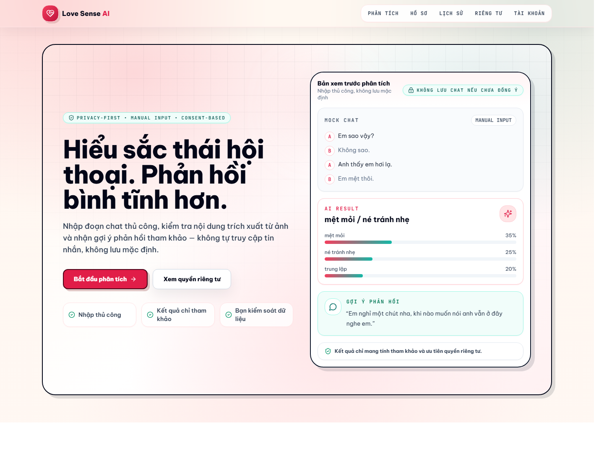
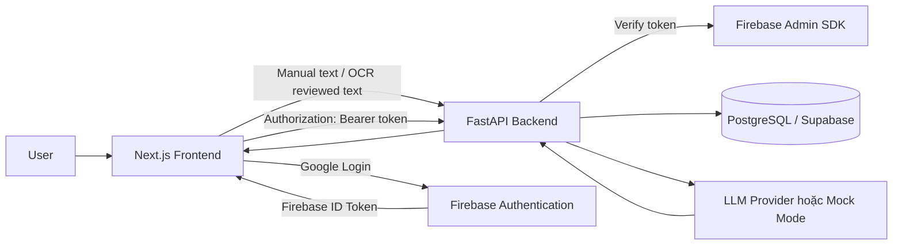

# CodeSense AI

**CodeSense AI** là hệ thống **Gia sư lập trình thích ứng dành cho sinh viên nhập môn Lập trình hướng đối tượng với C#** (Adaptive Programming Tutor for Beginner C# OOP Students). Hệ thống hỗ trợ sinh viên phân tích lỗi code, nhận gợi ý và hướng dẫn tư duy từng bước (Socratic tutoring), cá nhân hóa theo tiến độ học tập và bảo mật dữ liệu.

> **Ghi chú chuyển hướng (Pivot Note - APT-002):** Dự án được chuyển đổi từ sản phẩm ban đầu sang nền tảng CodeSense AI. Trạng thái baseline nguyên bản của Love Sense AI đã được đóng băng và bảo lưu tại git tag `love-sense-ai-final` và tài liệu [docs/pivot/BASELINE.md](docs/pivot/BASELINE.md). Báo cáo phân loại chuyển đổi tên được lưu tại [docs/pivot/RENAME_REPORT.md](docs/pivot/RENAME_REPORT.md).


## Live Demo

| Thành phần | Link |
| --- | --- |
| Frontend | https://love-sense-ai.vercel.app |
| Backend API Docs | https://love-sense-ai.onrender.com/docs |

## Ảnh Minh Họa

Ảnh dưới đây dùng dữ liệu minh họa, không phải nội dung chat thật của người dùng.



## Giới Thiệu Đề Tài

Trong giao tiếp qua tin nhắn, người dùng thường khó nhận biết sắc thái như mệt mỏi, né tránh nhẹ, giận dỗi, trêu đùa hoặc quan tâm. Việc hiểu sai ngữ cảnh có thể dẫn đến phản hồi căng thẳng hoặc thiếu tinh tế.

Love Sense AI được xây dựng để hỗ trợ người dùng nhìn lại đoạn hội thoại một cách bình tĩnh hơn:

- Phân tích sắc thái hội thoại dựa trên nội dung người dùng cung cấp.
- Gợi ý phản hồi nhẹ nhàng, tôn trọng và không thao túng cảm xúc.
- Cho phép bổ sung hồ sơ cá nhân hóa để kết quả bớt máy móc.
- Hỗ trợ OCR ảnh chụp hội thoại, nhưng luôn yêu cầu người dùng review/chỉnh sửa trước khi phân tích.
- Lưu lịch sử và hồ sơ khi người dùng đăng nhập, có consent rõ ràng.

Phạm vi của ứng dụng là **hỗ trợ tham khảo**. App không tự truy cập tin nhắn, không đọc dữ liệu từ Zalo/Messenger/SMS/notification và không kết luận chắc chắn cảm xúc thật của người khác.

## Tính Năng Chính

| Nhóm tính năng | Mô tả |
| --- | --- |
| Phân tích sắc thái hội thoại | Nhận diện cảm xúc tổng quan, độ tin cậy, phân bố cảm xúc, bằng chứng và điểm cần thận trọng. |
| OCR upload/review text | Tải ảnh chụp đoạn chat, trích xuất chữ, review và chỉnh sửa trước khi phân tích. |
| AI Vision OCR tùy chọn | Chỉ gửi ảnh đến AI provider khi người dùng tick consent riêng. Backend không lưu ảnh. |
| Hồ sơ cá nhân hóa | Lưu phong cách giao tiếp, bối cảnh quan hệ và ghi chú riêng để gợi ý phù hợp hơn. |
| Gợi ý phản hồi | Đưa ra câu trả lời nhẹ nhàng, tôn trọng, không gây áp lực. |
| Lịch sử phân tích | Lưu kết quả theo tài khoản khi người dùng bật consent lưu lịch sử. |
| Xóa dữ liệu | Xóa lịch sử, hồ sơ hoặc toàn bộ dữ liệu cá nhân của user hiện tại. |
| Firebase Google Login | Đăng nhập Google, frontend lấy Firebase ID Token, backend verify bằng Firebase Admin SDK. |
| Demo mode | Khách chưa đăng nhập vẫn dùng thử `/analyze`, nhưng không lưu history/profile. |

## Tài Khoản Và Phân Quyền

| Vai trò | Quyền sử dụng |
| --- | --- |
| Khách chưa đăng nhập | Dùng thử `/analyze`; không lưu lịch sử, không lưu hồ sơ, không truy cập dữ liệu cá nhân. |
| User đã đăng nhập Google | Lưu/xem/xóa profile, history, consent settings và user data của chính tài khoản đó. |

Các API bảo vệ dữ liệu sử dụng header:

```http
Authorization: Bearer <firebase_id_token>
```

Backend verify token, map `firebase_uid` sang `users.id` nội bộ và luôn lọc dữ liệu theo user hiện tại.

## Kiến Trúc Hệ Thống



Pipeline phân tích:

```text
User nhập hoặc review đoạn chat
→ Frontend gửi /api/analyze
→ Backend validate + safety filter
→ LLM service hoặc mock mode
→ Output validator
→ Response JSON chuẩn
→ Lưu history nếu user đăng nhập và có consent
```

## Tech Stack

| Lớp | Công nghệ |
| --- | --- |
| Frontend | Next.js App Router, React, TypeScript, Tailwind CSS |
| UI/Test Frontend | Vitest, React Testing Library, lucide-react |
| OCR Frontend | Tesseract.js, OCR review UX |
| Backend | FastAPI, Pydantic, pydantic-settings, Uvicorn |
| Auth | Firebase Authentication, Firebase Admin SDK, legacy JWT dev compatibility |
| Database | PostgreSQL/Supabase, SQLAlchemy async, migrations SQL |
| AI | OpenAI-compatible LLM provider, 9Router/OpenRouter-compatible config, mock mode |
| Deploy | Vercel frontend, Render backend |
| Verification | pytest, `npm run test`, typecheck, build, audit |

## Cấu Trúc Thư Mục

```text
love-sense-ai/
├── frontend/
│   ├── app/                 # Next.js App Router pages
│   ├── components/          # Shared UI, auth, analyze, home components
│   ├── contexts/            # AuthContext
│   ├── lib/                 # API client, Firebase, OCR helpers, types
│   └── styles/
├── backend/
│   ├── app/
│   │   ├── core/            # config, Firebase init, security
│   │   ├── deps/            # auth dependencies
│   │   ├── routes/          # FastAPI routers
│   │   ├── schemas/         # Pydantic schemas
│   │   ├── services/        # AI, DB repositories, validation, OCR vision
│   │   └── models/          # SQLAlchemy models
│   └── tests/
├── database/
│   ├── migrations/
│   └── schema.sql
├── docs/
│   ├── AUTH_FIREBASE.md
│   ├── DEMO_SCRIPT.md
│   ├── API_DOCUMENTATION.md
│   └── assets/love-sense-ai-home.png
├── SETUP.md
└── README.md
```

## Cài Đặt Local

1. Clone repo:

```powershell
git clone https://github.com/Peo051/love-sense-ai.git
cd love-sense-ai
```

2. Tạo env backend:

```powershell
cd backend
copy .env.example .env
```

3. Tạo env frontend:

```powershell
cd ..\frontend
copy .env.example .env.local
```

4. Điền Firebase Web SDK config vào `frontend/.env.local` nếu cần test Google Login.

5. Điền `FIREBASE_SERVICE_ACCOUNT_JSON` trong `backend/.env` nếu cần test API yêu cầu đăng nhập bằng Firebase ID Token.

## Cấu Hình Firebase

Trong Firebase Console:

1. Tạo project Firebase.
2. Vào **Authentication -> Sign-in method**.
3. Bật **Google provider**.
4. Vào **Authentication -> Settings -> Authorized domains**.
5. Thêm domain:
   - `localhost`
   - `love-sense-ai.vercel.app`
6. Vào **Project settings -> General -> Web apps** để lấy Firebase Web SDK config cho frontend.
7. Vào **Project settings -> Service accounts** để tạo service account JSON cho backend.

Không commit service account JSON. Production nên lưu JSON này trong Render Environment hoặc secret manager.

## Biến Môi Trường

### Frontend `.env.local`

```text
NEXT_PUBLIC_API_URL=http://localhost:8000
NEXT_PUBLIC_API_BASE_URL=http://localhost:8000
NEXT_PUBLIC_FIREBASE_API_KEY=
NEXT_PUBLIC_FIREBASE_AUTH_DOMAIN=
NEXT_PUBLIC_FIREBASE_PROJECT_ID=
NEXT_PUBLIC_FIREBASE_STORAGE_BUCKET=
NEXT_PUBLIC_FIREBASE_MESSAGING_SENDER_ID=
NEXT_PUBLIC_FIREBASE_APP_ID=
```

### Backend `.env`

```text
APP_ENV=development
FRONTEND_URL=http://localhost:3000
ALLOWED_ORIGINS=http://localhost:3000,http://127.0.0.1:3000,https://love-sense-ai.vercel.app
DATABASE_URL=sqlite+aiosqlite:///./love_emotion_dev.db
DATABASE_AUTO_CREATE=true
SECRET_KEY=change-this-for-local-dev
FIREBASE_SERVICE_ACCOUNT_JSON=

LLM_PROVIDER=openai
LLM_BASE_URL=https://openrouter.ai/api/v1
LLM_API_KEY=
LLM_MODEL=openai/gpt-4o-mini
LLM_MOCK_MODE=false
LLM_TIMEOUT_SECONDS=30
LLM_MAX_RETRIES=2
LLM_RETRY_BASE_DELAY_SECONDS=0.25
VISION_MODEL=openai/gpt-4o-mini
RATE_LIMIT_MAX_REQUESTS=20
RATE_LIMIT_WINDOW_SECONDS=60
```

Production phải dùng PostgreSQL/Supabase thật cho `DATABASE_URL`, `SECRET_KEY` mạnh và `FIREBASE_SERVICE_ACCOUNT_JSON` từ Firebase service account. Khi cần test local ổn định không gọi provider thật, có thể đặt `LLM_MOCK_MODE=true`.

## Chạy Project Local

Frontend:

```powershell
cd frontend
npm install
npm run dev
```

Mở:

```text
http://localhost:3000
```

Backend:

```powershell
cd backend
python -m venv venv
venv\Scripts\activate
python -m pip install -r requirements.txt
uvicorn app.main:app --reload --port 8000
```

Kiểm tra:

```text
http://localhost:8000/health
http://localhost:8000/docs
```

## API Chính

| Method | Endpoint | Auth | Mục đích |
| --- | --- | --- | --- |
| `GET` | `/` | Không | Root health/message. |
| `GET` | `/health` | Không | Health check production/local. |
| `GET` | `/api/me` | Bắt buộc | Trả user hiện tại theo Firebase ID Token hoặc legacy JWT dev. |
| `POST` | `/api/analyze` | Tùy chọn | Phân tích đoạn chat; guest dùng được nhưng không lưu history. |
| `POST` | `/api/ocr/vision` | Consent riêng | OCR bằng AI Vision khi user đồng ý gửi ảnh. |
| `GET` | `/api/profile` | Bắt buộc | Lấy hồ sơ cá nhân hóa của user hiện tại. |
| `POST` | `/api/profile` | Bắt buộc | Tạo/cập nhật hồ sơ cá nhân hóa. |
| `DELETE` | `/api/profile` | Bắt buộc | Xóa hồ sơ cá nhân hóa. |
| `GET` | `/api/history` | Bắt buộc | Lấy lịch sử phân tích của user hiện tại. |
| `GET` | `/api/history/{id}` | Bắt buộc | Xem chi tiết một lịch sử thuộc user hiện tại. |
| `DELETE` | `/api/history/{id}` | Bắt buộc | Xóa một lịch sử thuộc user hiện tại. |
| `DELETE` | `/api/history` | Bắt buộc | Xóa toàn bộ lịch sử của user hiện tại. |
| `GET` | `/api/consent` | Bắt buộc | Lấy cài đặt consent. |
| `POST` | `/api/consent` | Bắt buộc | Lưu cài đặt consent. |
| `DELETE` | `/api/user-data` | Bắt buộc | Xóa profile, history và consent của user hiện tại. |

Chi tiết request/response nằm trong [docs/API_DOCUMENTATION.md](docs/API_DOCUMENTATION.md).

## Flow Đăng Nhập

1. User bấm **Tiếp tục với Google** tại `/login`.
2. Firebase Authentication mở Google popup.
3. Sau khi đăng nhập, frontend nhận Firebase user.
4. Frontend lấy Firebase ID Token bằng `getIdToken()`.
5. API client gửi token qua `Authorization: Bearer <firebase_id_token>`.
6. Backend verify token bằng Firebase Admin SDK.
7. Backend map `firebase_uid` với `users.id` nội bộ.
8. Backend xử lý profile/history/consent theo `users.id` hiện tại.

Nếu user chưa đăng nhập, frontend vẫn cho dùng thử `/analyze`. Backend sẽ trả `authenticated=false` và không lưu history.

## Privacy Note

Love Sense AI xử lý dữ liệu theo nguyên tắc tối thiểu:

- App không tự truy cập tin nhắn của người dùng.
- Người dùng tự nhập hoặc tải nội dung cần phân tích.
- Ảnh OCR không được lưu mặc định.
- Chat của khách chưa đăng nhập không được lưu vào history.
- Nội dung chat gốc chỉ lưu khi user đăng nhập và bật `save_input=true`.
- Kết quả chỉ mang tính tham khảo, không thể thay thế giao tiếp trực tiếp.
- Không nên dùng app để giám sát, kiểm soát hoặc kết luận chắc chắn về người khác.
- User có thể xóa lịch sử, hồ sơ hoặc toàn bộ dữ liệu cá nhân tại `/privacy`.

## Demo Script

Kịch bản demo 3 phút nằm tại [docs/DEMO_SCRIPT.md](docs/DEMO_SCRIPT.md).

Tóm tắt luồng demo:

1. Đăng nhập Google.
2. Nhập thủ công hoặc upload ảnh đoạn chat.
3. Review/chỉnh sửa text OCR.
4. Phân tích sắc thái hội thoại.
5. Xem kết quả và lưu history khi có consent.
6. Mở `/history` để xem lại.
7. Mở `/privacy` để xóa dữ liệu demo.

## Deploy

### Frontend: Vercel

- Root/source directory: `frontend/`
- Build command: `npm run build`
- Framework: Next.js
- Env cần có:

```text
NEXT_PUBLIC_API_URL=https://love-sense-ai.onrender.com
NEXT_PUBLIC_API_BASE_URL=https://love-sense-ai.onrender.com
NEXT_PUBLIC_FIREBASE_API_KEY=
NEXT_PUBLIC_FIREBASE_AUTH_DOMAIN=
NEXT_PUBLIC_FIREBASE_PROJECT_ID=
NEXT_PUBLIC_FIREBASE_STORAGE_BUCKET=
NEXT_PUBLIC_FIREBASE_MESSAGING_SENDER_ID=
NEXT_PUBLIC_FIREBASE_APP_ID=
```

### Backend: Render

- Root/source directory: `backend/`
- Build command: `python -m pip install -r requirements.txt`
- Start command: `uvicorn app.main:app --host 0.0.0.0 --port $PORT`
- Env cần có:

```text
APP_ENV=production
FRONTEND_URL=https://love-sense-ai.vercel.app
ALLOWED_ORIGINS=https://love-sense-ai.vercel.app
DATABASE_URL=<postgresql-or-supabase-url>
DATABASE_AUTO_CREATE=false
SECRET_KEY=<strong-random-secret>
FIREBASE_SERVICE_ACCOUNT_JSON=<firebase-service-account-json-string>
LLM_MOCK_MODE=false
LLM_PROVIDER=<provider>
LLM_BASE_URL=<provider-base-url>
LLM_API_KEY=<provider-api-key>
LLM_MODEL=<model-name>
```

### Database: PostgreSQL/Supabase

- Tạo database PostgreSQL.
- Chạy `database/schema.sql` nếu setup mới.
- Nếu database đã tồn tại, chạy migration theo thứ tự trong `database/migrations/`.

### Firebase Console

- Bật Google provider.
- Thêm authorized domains.
- Kiểm tra service account backend thuộc đúng Firebase project.

## Test / Build

Frontend:

```powershell
cd frontend
npm install
npm run test
npm run typecheck
npm run build
npm audit
```

Backend:

```powershell
cd backend
python -m pip install -r requirements.txt
python -c "from app.main import app; print('backend import ok')"
python -m compileall app
python -m pytest tests
```

## Migration Database

Migration Firebase Auth mới:

```text
database/migrations/009_add_firebase_uid_to_users.sql
```

Migration này thêm cột `firebase_uid` vào bảng `users` và tạo index tương ứng. Cần chạy migration này trên production database trước khi dùng Firebase Google Login đầy đủ.

Nếu production chưa chạy migration này, request có Firebase token có thể lỗi:

```text
column users.firebase_uid does not exist
```

Kiểm tra nhanh trên PostgreSQL/Supabase:

```sql
SELECT column_name
FROM information_schema.columns
WHERE table_name = 'users'
  AND column_name = 'firebase_uid';
```

Ví dụ:

```powershell
psql -U postgres -d loveemotion -f database/migrations/009_add_firebase_uid_to_users.sql
```

## Troubleshooting

| Lỗi | Nguyên nhân thường gặp | Cách xử lý |
| --- | --- | --- |
| `auth/unauthorized-domain` | Domain frontend chưa được thêm trong Firebase Authorized domains. | Thêm `localhost`, `love-sense-ai.vercel.app` hoặc preview domain đang dùng. |
| `Missing FIREBASE_SERVICE_ACCOUNT_JSON` | Backend production thiếu Firebase Admin credential. | Đặt env trên Render, restart service. |
| `Invalid or expired authentication token` | Token hết hạn, sai project Firebase hoặc header thiếu `Bearer`. | Đăng nhập lại, kiểm tra frontend config và service account cùng project. |
| `column users.firebase_uid does not exist` | Production database chưa chạy migration Firebase Auth. | Chạy `database/migrations/009_add_firebase_uid_to_users.sql`, restart backend và test lại `/api/analyze`. |
| CORS blocked `Authorization` header | Backend chưa cho frontend origin hoặc header. | Kiểm tra `FRONTEND_URL`, `ALLOWED_ORIGINS`; backend đang dùng `allow_headers=["*"]`. |
| `LLM_MOCK_MODE` boolean parse error | Env boolean để rỗng hoặc sai format. | Dùng `true`/`false`; backend đã có default an toàn cho giá trị rỗng. |
| Render deploy fail do thiếu env | `APP_ENV=production` yêu cầu `DATABASE_URL`, `SECRET_KEY`, `FRONTEND_URL`. | Bổ sung env production trên Render. |
| Vercel env chưa áp dụng | Thêm env nhưng chưa redeploy. | Redeploy frontend sau khi cập nhật env. |

## Roadmap

- Fine-tune hoặc đánh giá model tiếng Việt chuyên sâu hơn.
- Cải thiện OCR cho ảnh nền phức tạp, chữ nhỏ, emoji và teencode.
- Dashboard xu hướng cảm xúc theo thời gian.
- Export báo cáo PDF từ lịch sử phân tích.
- Hỗ trợ đa ngôn ngữ.
- Phiên bản mobile app sau web.

## Thành Viên / Tác Giả

- Tác giả: Trần Dương Gia Bảo
- Mục đích: Nghiên cứu ứng dụng AI trong giao tiếp số.

## License

This project is for educational/demo purposes. Nếu repo public và cần dùng lâu dài, có thể bổ sung MIT License hoặc license phù hợp với yêu cầu môn học.

## Tài Liệu Liên Quan

- [Firebase Auth Guide](docs/AUTH_FIREBASE.md)
- [Demo Script](docs/DEMO_SCRIPT.md)
- [API Documentation](docs/API_DOCUMENTATION.md)
- [Privacy Design](docs/PRIVACY_DESIGN.md)
- [OCR and Vision Plan](docs/OCR_AND_VISION_PLAN.md)
- [Deployment Guide](docs/DEPLOYMENT.md)
- [Testing Guide](docs/TESTING.md)
- [Project Guide](docs/PROJECT_GUIDE.md)
