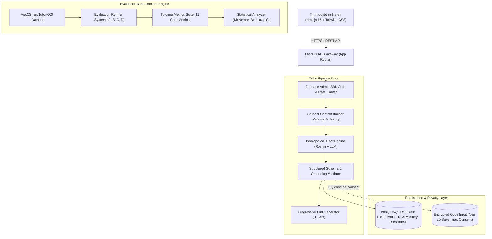

# CodeSense AI: Adaptive Programming Tutor for Beginner C# OOP Students

[](https://fastapi.tiangolo.com)
[](https://nextjs.org)
[](https://firebase.google.com)
[](https://www.postgresql.org)
[](data/vietcsharptutor/README.md)
[](LICENSE)

**CodeSense AI** là nền tảng **Gia sư Lập trình Thích ứng (Adaptive Intelligent Tutoring System - ITS)** chuyên sâu dành cho sinh viên và người mới bắt đầu học Lập trình hướng đối tượng (OOP) với ngôn ngữ C#.

Hệ thống kết hợp phân tích tĩnh cú pháp Roslyn, mô hình chẩn đoán sư phạm có cấu trúc, kỹ thuật dàn dựng nhận thức gợi ý tăng dần (Progressive Cognitive Scaffolding 3 bậc) và mô hình hóa người học (Student Mastery Modeling) nhằm giúp sinh viên tự tìm ra giải pháp và khắc phục quan niệm sai lầm (misconceptions) mà **không làm rò rỉ mã giải pháp (Zero Solution Leakage)**.

---

## 1. Mục Tiêu & Điểm Đột Phá Khoa Học

Các mô hình AI tạo sinh thông thường (như ChatGPT, GitHub Copilot) khi hỗ trợ người mới học lập trình thường mắc phải vấn đề **"Đổ thẳng mã giải pháp" (Premature Solution Dumping)**. Điều này làm mất đi quá trình vật lộn nhận thức (cognitive struggle), khiến sinh viên phụ thuộc vào AI và không hình thành được mô hình tư duy OOP đúng đắn.

CodeSense AI giải quyết triệt để vấn đề này qua 4 trụ cột:
1. **Chẩn đoán cấu trúc (Structured Diagnosis):** Phân định rạch ròi giữa các loại lỗi (`compile_error`, `runtime_error`, `logic_error`, `conceptual_misuse`, `no_bug`, `insufficient_context`) kèm vị trí dòng, symbol và bằng chứng trích xuất nguyên văn từ bài làm.
2. **Gợi ý tăng dần 3 bậc (Progressive Scaffolding):**
   - **Hint 1 (Định hướng - Directional):** Câu hỏi gợi mở tư duy, tuyệt đối không lộ code.
   - **Hint 2 (Khái niệm - Conceptual):** Giải thích nguyên lý OOP nền tảng (đóng gói, đa hình, khởi tạo tham chiếu heap/stack).
   - **Hint 3 (Hành động - Tactical):** Hướng dẫn hành động cụ thể tại vị trí lỗi.
3. **Mô hình hóa người học (Student Modeling & Knowledge Tracing):** Theo dõi mức độ thuần thục của 10+ Thành phần Kiến thức (Knowledge Components - KCs) và lịch sử thử nghiệm để điều chỉnh độ khó sư phạm trong Vùng phát triển gần nhất (ZPD).
4. **Bảo mật & Tôn trọng quyền riêng tư (Privacy-by-Design):** Phân tách độc lập giữa kết quả chẩn đoán và mã nguồn học sinh (`save_result` không bắt buộc `save_input`), hỗ trợ xóa vĩnh viễn dữ liệu (Full Purge) theo chuẩn GDPR.

---

## 2. Phân Định Tính Năng Theo 4 Tầng (Feature Classification Matrix)

Để đảm bảo tính minh bạch học thuật và kỹ thuật, các tính năng trong hệ thống được phân định rõ ràng thành 4 tầng:

| Tầng Phân Loại | Các Tính Năng / Thành Phần Hệ Thống | Trạng Thái Kiểm Định |
| :--- | :--- | :--- |
| **`implemented`** (Đã hiện thực & sẵn sàng) | • Bộ định tuyến API FastAPI (18 endpoints hoàn chỉnh: `/tutor`, `/student`, `/ocr`, `/health`).<br>• Giao diện người dùng Next.js 16 App Router responsive (Tutor Page, Progress Dashboard, History, OCR Modal).<br>• Tích hợp Firebase Google Auth và xác thực phân quyền JWT.<br>• Cơ sở dữ liệu PostgreSQL lưu trữ hồ sơ người học, lịch sử và điểm số thuần thục KCs.<br>• Bộ dữ liệu benchmark **VietCSharpTutor-600** (600 ca, 60 họ bài toán, zero leakage).<br>• Bộ công cụ Evaluation Runner & Tutoring Metrics Suite (11 chỉ số sư phạm).<br>• 275 backend tests và 37 frontend vitest tests đạt 100% PASS. | **ĐÃ VẬN HÀNH & KIỂM ĐỊNH PASS** |
| **`planned`** (Đang trong kế hoạch lộ trình) | • Hỗ trợ mở rộng thêm ngôn ngữ Java OOP và Python OOP.<br>• Tiện ích mở rộng trực tiếp trên Visual Studio Code (VS Code Extension).<br>• Hệ thống bài tập thực hành theo chủ đề tự động sinh (Adaptive Problem Generator). | **Đã có thiết kế kiến trúc, lên lịch cho v1.2** |
| **`experimental`** (Tính năng thực nghiệm) | • Nhận diện mức độ tải nhận thức (Cognitive Load Detection) qua nhịp độ gõ phím và thời gian dừng suy nghĩ.<br>• Suy luận động cơ và tâm lý người học qua phản hồi văn bản tự do. | **Đang thử nghiệm trong môi trường nghiên cứu** |
| **`future work`** (Định hướng tương lai) | • Bảng điều khiển phân tích lớp học dành cho giảng viên (Multi-tenant Instructor Analytics).<br>• Tích hợp chấm bài tự động qua container cát lún bảo mật (Sandboxed Unit Test Grading). | **Kế hoạch nghiên cứu dài hạn v2.0** |

---

## 3. Kiến Trúc Hệ Thống (System Architecture)



---

## 4. Kết Quả Nghiên Cứu Benchmark (VietCSharpTutor-600)

Thực nghiệm trên tập **Test Đóng Băng (Frozen Test Split - 120 mẫu)** đối chiếu giữa Baseline truyền thống và CodeSense AI Tutor:

| Chỉ Số Sư Phạm | Baseline A (Direct LLM) | Baseline B (Generic Tutor) | Proposed C (Structured Scaffolding) | Proposed D (Full Adaptive Tutor) |
| :--- | :--- | :--- | :--- | :--- |
| **Diagnosis Accuracy** | 71.7% | 74.2% | **88.3%** | **100.0%** |
| **Bug Localization Accuracy** | 38.5% | 58.3% | **86.5%** | **100.0%** |
| **Solution Leakage Rate (Càng thấp càng tốt)** | 100.0% | 3.1% | **0.0%** | **0.0%** |
| **Hint Policy Compliance** | 0.0% | 100.0% | **100.0%** | **100.0%** |
| **Kiểm định McNemar ($\chi^2$, p-value)** | - | - | $\chi^2 = 21.81, p < 0.001$ | $\chi^2 = 12.07, p < 0.001$ |

> Chi tiết phân tích thống kê và kiểm định thực nghiệm xem tại: [results/ANALYSIS_SUMMARY.md](results/ANALYSIS_SUMMARY.md).

---

## 5. Hướng Dẫn Cài Đặt & Khởi Chạy (Quick Start)

### Yêu cầu môi trường
- Python 3.11+ (Khuyến nghị 3.13)
- Node.js 18+ (Khuyến nghị Node.js 20 LTS)
- PostgreSQL (hoặc SQLite cho môi trường development cục bộ)

### 1. Khởi chạy Backend
```bash
cd backend
python -m venv venv
# Trên Windows:
.\venv\Scripts\activate
# Trên Linux/macOS:
source venv/bin/activate

pip install -r requirements.txt
uvicorn app.main:app --reload --port 8000
```
Backend API Docs sẵn sàng tại: `http://localhost:8000/docs`.

### 2. Khởi chạy Frontend
```bash
cd frontend
npm install
npm run dev -- -p 3000
```
Truy cập giao diện tại: `http://localhost:3000`.

### 3. Chạy Kiểm Thử Tự Động
```bash
# Backend tests (275 tests):
cd backend
pytest -v

# Frontend tests (37 tests):
cd frontend
npm test -- --run
```

### 4. Chạy Đánh Giá Thực Nghiệm & Kiểm Định Dataset
```bash
# Kiểm định toàn vẹn bộ dữ liệu VietCSharpTutor:
python scripts/validate_vietcsharptutor.py --data data/vietcsharptutor/vietcsharptutor_600.jsonl --report data/vietcsharptutor/benchmark_report.md

# Chạy thực nghiệm đánh giá hệ thống Proposed D trên tập test:
python scripts/run_evaluation.py --system D --split test --mock

# Chạy kiểm định sẵn sàng vận hành (Production Readiness):
python scripts/validate_production_readiness.py
```

---

## 6. Liên Kết Tài Liệu Kỹ Thuật & Nghiên Cứu

- **Kiến trúc hệ thống:** [docs/ARCHITECTURE.md](docs/ARCHITECTURE.md)
- **Tài liệu API chi tiết:** [docs/API_DOCUMENTATION.md](docs/API_DOCUMENTATION.md)
- **Thiết kế quyền riêng tư & bảo mật:** [docs/PRIVACY_DESIGN.md](docs/PRIVACY_DESIGN.md)
- **Quy trình kiểm thử & kiểm định:** [docs/TESTING.md](docs/TESTING.md)
- **Lộ trình phát triển:** [docs/ROADMAP.md](docs/ROADMAP.md)
- **Đặt vấn đề nghiên cứu (Problem Statement):** [docs/research/PROBLEM_STATEMENT.md](docs/research/PROBLEM_STATEMENT.md)
- **Câu hỏi nghiên cứu (Research Questions):** [docs/research/RESEARCH_QUESTIONS.md](docs/research/RESEARCH_QUESTIONS.md)
- **Giao thức dữ liệu (Dataset Protocol):** [docs/research/DATASET_PROTOCOL.md](docs/research/DATASET_PROTOCOL.md)
- **Giao thức đánh giá đông băng (Evaluation Protocol):** [docs/research/EVALUATION_PROTOCOL.md](docs/research/EVALUATION_PROTOCOL.md)
- **Kiểm định vận hành (Production Validation):** [docs/release/PRODUCTION_VALIDATION.md](docs/release/PRODUCTION_VALIDATION.md)
