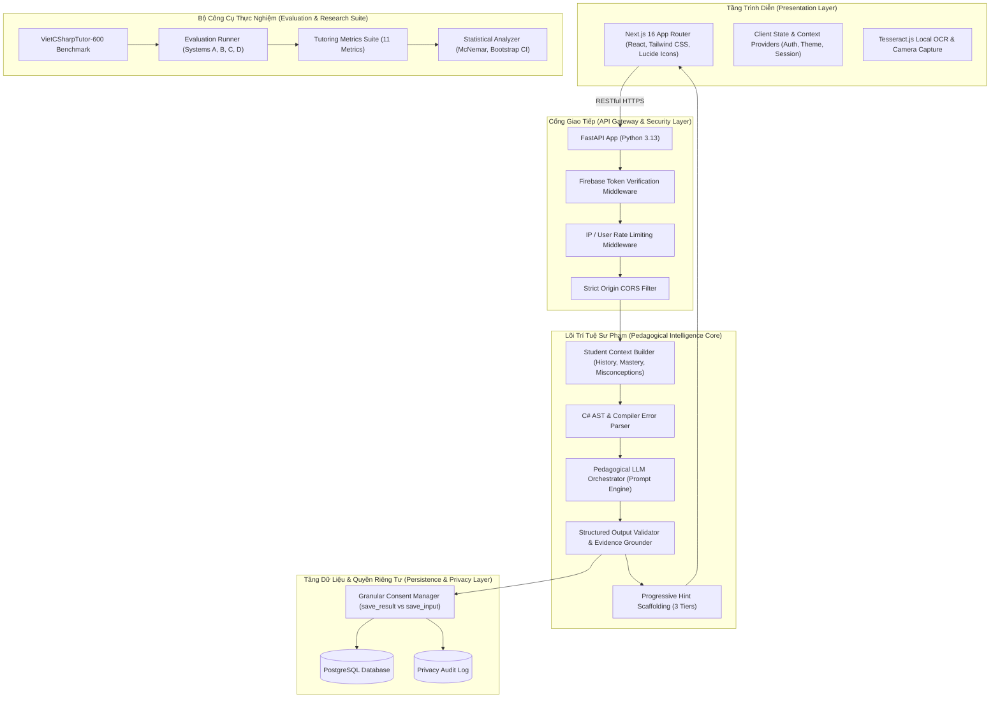

# Kiến Trúc Hệ Thống CodeSense AI (System Architecture)

Tài liệu đặc tả kiến trúc kỹ thuật của nền tảng **CodeSense AI - Adaptive Programming Tutor**.

---

## 1. Tổng Quan Kiến Trúc (High-Level Architecture)

Hệ thống được thiết kế theo mô hình phân lớp hiện đại (Layered Micro-Modular Architecture), phân tách độc lập giữa giao diện người dùng, cổng API, lõi xử lý sư phạm, lớp lưu trữ bảo mật và bộ công cụ đánh giá thực nghiệm:

---

## 2. Luồng Xử Lý Sư Phạm (Pedagogical Pipeline Flow)

Khi sinh viên nộp bài làm C# trên giao diện gia sư:

1. **Tiếp nhận & Làm sạch (Ingestion):**
   - API endpoint `/api/tutor/analyze` nhận mã nguồn `student_code`, đề bài `problem_statement`, thông báo lỗi biên dịch (nếu có) và cờ đồng ý `consent`.
   - Kiểm tra giới hạn kích thước (payload size) và bảo vệ an toàn máy chủ (chống thực thi mã nhị phân).
2. **Xây dựng ngữ cảnh học viên (Student Context Building):**
   - Hệ thống truy vấn điểm số thuần thục (Mastery Score) của các Thành phần Kiến thức (KCs) liên quan và lịch sử các lần thử trước đó từ cơ sở dữ liệu.
3. **Chẩn đoán có cấu trúc (Structured LLM Diagnosis):**
   - Đưa ngữ cảnh học viên vào prompt đóng băng để suy luận: `bug_status`, `error_category`, `bug_type`, `bug_location` (start_line, end_line, symbol), `knowledge_components`, `possible_misconception`.
4. **Kiểm định dữ liệu & Neo bằng chứng (Grounding & Validation):**
   - Ràng buộc: `evidence` bắt buộc phải là một chuỗi con nguyên văn trong `student_code`.
   - Nếu `no_bug`: bắt buộc không có bằng chứng, không có vị trí lỗi.
   - Nếu `insufficient_context`: yêu cầu người học bổ sung định nghĩa lớp/yêu cầu bài toán.
5. **Phân tầng gợi ý (Progressive Hint Scaffolding):**
   - Sinh 3 tầng gợi ý: Hint 1 (Định hướng), Hint 2 (Khái niệm), Hint 3 (Hành động).
   - Chỉ trả về Hint 1 cho sinh viên ở bước đầu tiên để kích thích tư duy độc lập. Các Hint tiếp theo chỉ mở khi sinh viên yêu cầu thông qua `/api/tutor/hint`.
6. **Lưu trữ bảo vệ quyền riêng tư (Privacy-Preserving Storage):**
   - Lưu kết quả chẩn đoán và cập nhật Mastery KCs.
   - Mã nguồn học sinh chỉ được lưu nếu học viên bật cờ `save_input_consent = True`. Ngược lại, mã thô lập tức bị hủy bỏ khỏi bộ nhớ tạm.

---

## 3. Phân Định Tính Năng Theo 4 Tầng (Classification Tiers)

### 3.1. Tầng `implemented` (Đã hoàn thiện và kiểm thử thành công)
- Toàn bộ 18 API routes của backend và 4 trang chức năng chính của frontend.
- Kiến trúc Socratic Progressive Scaffolding 3 bậc không rò rỉ mã giải pháp.
- Mô hình hóa năng lực người học qua 10+ thẻ Knowledge Components (OOP.Classes, OOP.Constructors, OOP.Encapsulation, OOP.Polymorphism, v.v.).
- Bộ dữ liệu chuẩn mực **VietCSharpTutor-600** kèm CLI Validator.
- Hệ thống Evaluation Runner, Metrics Suite và kiểm định thống kê McNemar / Bootstrap 95% CI.
- Hệ thống xóa sạch dữ liệu cá nhân (GDPR-compliant Right to Erasure).

### 3.2. Tầng `planned` (Đã có thiết kế kiến trúc, lên kế hoạch cho v1.2)
- Hỗ trợ đa ngôn ngữ hướng đối tượng (Java OOP và Python OOP).
- Extension hỗ trợ trực tiếp trong IDE (VS Code và JetBrains Rider).
- Bộ tạo bài tập lập trình thích ứng tự động (Adaptive Exercise Generator) dựa trên KCs còn yếu của học viên.

### 3.3. Tầng `experimental` (Thực nghiệm nghiên cứu)
- Nhận diện mức độ tải nhận thức (Cognitive Load Detection) dựa trên thời gian suy nghĩ và nhịp gõ phím.
- Phân tích sắc thái câu hỏi tự do của người học để phát hiện cảm giác chán nản hoặc thất vọng trong quá trình sửa lỗi.

### 3.4. Tầng `future work` (Định hướng nghiên cứu dài hạn v2.0)
- Bảng điều khiển phân tích tổng quan cho giảng viên và nhà trường (Instructor Classroom Analytics).
- Hệ thống chấm bài và sinh test case tự động qua container cát lún bảo mật (Sandboxed Dynamic Test Execution).
