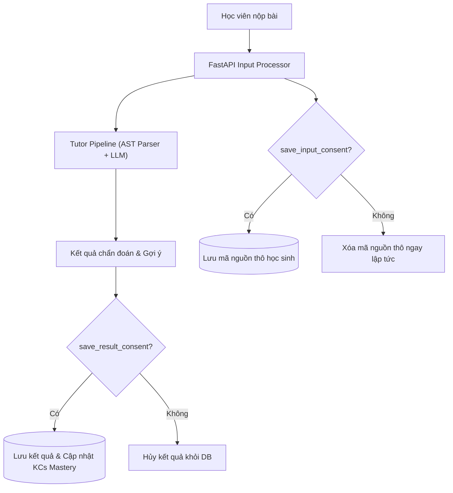

# Thiết Kế Quyền Riêng Tư & Bảo Mật Dữ Liệu (Privacy & Security Design)

Tài liệu đặc tả các nguyên tắc và cơ chế bảo vệ quyền riêng tư người học trong hệ thống **CodeSense AI**.

---

## 1. Nguyên Tắc Cốt Lõi (Core Principles)

Trong môi trường giáo dục đại học, mã nguồn học sinh và lịch sử giải bài phản ánh năng lực cá nhân và quá trình tư duy của người học. CodeSense AI tuân thủ nghiêm ngặt 5 nguyên tắc bảo vệ quyền riêng tư:

1. **Tối thiểu hóa dữ liệu (Data Minimization):** Hệ thống chỉ yêu cầu những thông tin thực sự cần thiết để chẩn đoán lỗi cú pháp và khái niệm OOP.
2. **Phân tách Dữ liệu Đầu vào & Kết quả (Input-Result Decoupling):**
   - Học viên có quyền lưu kết quả chẩn đoán và gợi ý sư phạm để theo dõi tiến độ (`save_result_consent = True`) mà KHÔNG cần lưu mã nguồn nộp (`save_input_consent = False`).
   - Khi `save_input_consent = False`, mã nguồn của học sinh chỉ tồn tại trong RAM trong quá trình LLM phân tích và bị xóa bỏ vĩnh viễn ngay sau khi phản hồi hoàn tất.
3. **Đồng ý tường minh (Explicit Granular Consent):**
   - Tính năng trích xuất mã qua AI Vision yêu cầu cờ consent riêng biệt (`ai_vision_consent = True`).
   - Không tự ý chia sẻ hoặc huấn luyện lại mô hình bên ngoài bằng mã nguồn cá nhân của học sinh.
4. **Quyền được lãng quên (Right to Erasure / GDPR Compliance):**
   - Học viên có quyền xóa từng phiên làm việc cụ thể (`DELETE /student/history/{session_id}`) hoặc yêu cầu thanh lọc toàn bộ dữ liệu (`DELETE /student/data`).
   - Thao tác thanh lọc toàn bộ (Full Purge) xóa sạch mọi thông tin trong bảng Profile, History, Session Attempts, và KCs Mastery.
5. **Không lưu trữ Secret & Thông tin Định danh Cá nhân (PII Elimination):**
   - Dữ liệu benchmark `VietCSharpTutor-600` và các run manifests hoàn toàn không chứa email, tên thật hay API keys.

---

## 2. Kiến Trúc Phân Tách Lưu Trữ Bảo Mật

---

## 3. Tiêu Chuẩn An Toàn Mã Nguồn & Vận Hành

1. **Không thực thi mã học sinh tùy ý (No Arbitrary Code Execution):**
   - Tuyệt đối không biên dịch hay chạy mã nguồn người dùng trực tiếp trên server backend.
   - Quá trình chẩn đoán hoàn toàn dựa trên phân tích cú pháp tĩnh (Static AST Parsing / Roslyn rules) và suy luận mô hình ngôn ngữ (LLM).
2. **Kiểm duyệt nhật ký máy chủ (No Raw Code in Server Logs):**
   - Hệ thống logging ghi nhận lỗi và chỉ số vận hành nhưng tự động làm sạch (scrubbing) mã nguồn thô và chuỗi nhạy cảm.
3. **Chống truy cập chéo (Cross-User Isolation):**
   - Ràng buộc phân quyền dựa trên `user_id` từ Firebase JWT token đảm bảo học sinh A không thể xem hoặc chỉnh sửa lịch sử của học sinh B.

---

## 4. Phân Định Tính Năng Quyền Riêng Tư (4 Tiers)

- **`implemented`:** Toàn bộ cơ chế Decoupled Consent, Full Purge, AI Vision Consent, Scrubbed Server Logs đã được kiểm định đạt chuẩn 100% trong `PRODUCTION_VALIDATION.md`.
- **`planned`:** Tính năng xuất toàn bộ dữ liệu cá nhân theo định dạng JSON nén có mã hóa mật khẩu (Data Portability v1.2).
- **`experimental`:** Cơ chế ẩn danh hóa mã nguồn tự động (Automatic Identifier Anonymization) trước khi gửi qua API ngoài.
- **`future work`:** Mã hóa đầu cuối (End-to-End Encryption) cho các phiên làm việc riêng tư giữa gia sư và người học (v2.0).
