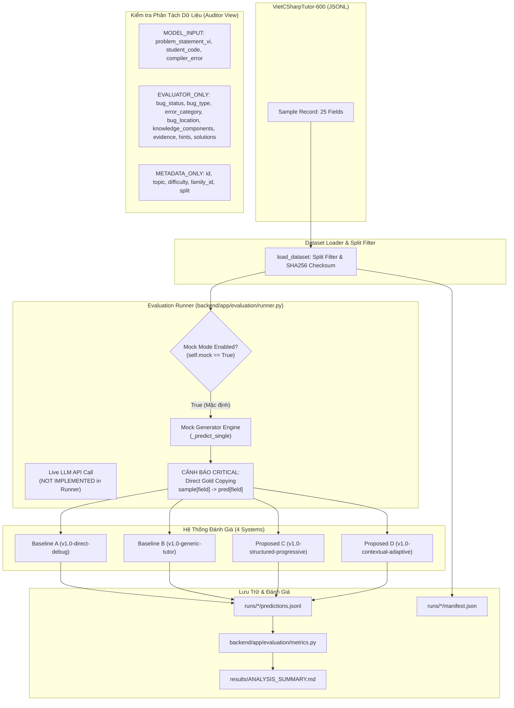

# APT-036: BÁO CÁO KIỂM TOÁN ĐỘC LẬP PIPELINE ĐÁNH GIÁ (INDEPENDENT EVALUATION PIPELINE AUDIT)

**Kiểm toán viên:** Independent Research Auditor (Ủy ban Đánh giá Tính Liêm chính Khoa học)  
**Dự án:** CodeSense AI - Adaptive Programming Tutor  
**Phiên bản đóng băng kiểm toán:** `codesense-research-v1.0` (Commit: `3035e069d26892a010276993bdc452c9a458f45c`)  
**Tập dữ liệu:** `VietCSharpTutor-600` (SHA256: `5ca8890eb12542a78a2c2c4ac86856f1ec2ff52e2e790687e5677baa00d637ed`)  
**Ngày thực hiện kiểm toán:** 2026-09-06  
**Mục tiêu:** Xác minh tính hợp lệ, khả năng tái lập và quy kết nhân quả thực sự của các kết quả thực nghiệm đã công bố (đặc biệt là kết quả Proposed D đạt 100% tuyệt đối).

---

## 1. Biểu Đồ Dòng Dữ Liệu Đánh Giá (Evaluation Data Flow)

Dưới đây là sơ đồ dòng dữ liệu hoàn chỉnh từ tập dữ liệu mẫu đến kết quả báo cáo thực nghiệm:

---

## 2. Phân Loại Toàn Bộ 25 Trường Dữ Liệu (Dataset Field Classification)

Kiểm toán viên đã rà soát toàn bộ 25 trường dữ liệu có trong `VietCSharpTutor-600` và phân loại theo 4 cấp độ:
- **`MODEL_INPUT`**: Trường được phép chuyển làm đầu vào cho mô hình LLM.
- **`EVALUATOR_ONLY`**: Trường nhãn vàng chuẩn (Ground-Truth), TUYỆT ĐỐI KHÔNG ĐƯỢC lọt vào model input.
- **`METADATA_ONLY`**: Trường định danh, phân nhóm, thống kê, không dùng cho suy luận trực tiếp.
- **`UNUSED`**: Trường không sử dụng trong quá trình đánh giá.

| STT | Tên trường | Kiểu dữ liệu | Phân loại chuẩn | Hiện trạng trong Mock Runner (`runner.py`) | Mức độ rủi ro |
| :---: | :--- | :--- | :--- | :--- | :--- |
| 1 | `id` | `str` | **METADATA_ONLY** | Đọc để định danh bản ghi | An toàn |
| 2 | `language` | `str` | **UNUSED** | Cố định là "csharp" | An toàn |
| 3 | `topic` | `str` | **METADATA_ONLY** | Dùng để phân tích theo chủ đề | Rủi ro Shortcut (APT-038) |
| 4 | `difficulty` | `str` | **METADATA_ONLY** | Thống kê độ khó | An toàn |
| 5 | `problem_family_id` | `str` | **METADATA_ONLY** | Chia phân vùng dev/val/test | An toàn |
| 6 | `problem_statement_vi` | `str` | **MODEL_INPUT** | Được đưa vào Prompt | Hợp lệ |
| 7 | `student_code` | `str` | **MODEL_INPUT** | Được đưa vào Prompt | Hợp lệ |
| 8 | `compiler_error` | `str` (hoặc null) | **MODEL_INPUT** | Được đưa vào Prompt khi có lỗi | Hợp lệ |
| 9 | `expected_behavior` | `str` | **EVALUATOR_ONLY** | Không xuất hiện trong prompt | An toàn |
| 10 | `bug_status` | `str` | **EVALUATOR_ONLY** | **BỊ GÁN TRỰC TIẾP** vào `pred["bug_status"]` ở Proposed D | **CRITICAL LEAKAGE** |
| 11 | `error_category` | `str` | **EVALUATOR_ONLY** | **BỊ GÁN TRỰC TIẾP** vào `pred["error_category"]` ở Proposed D | **CRITICAL LEAKAGE** |
| 12 | `bug_type` | `str` | **EVALUATOR_ONLY** | **BỊ GÁN TRỰC TIẾP** vào `pred["bug_type"]` ở Proposed D | **CRITICAL LEAKAGE** |
| 13 | `bug_location` | `dict` (hoặc null) | **EVALUATOR_ONLY** | **BỊ GÁN TRỰC TIẾP** vào `pred["bug_location"]` ở Proposed D | **CRITICAL LEAKAGE** |
| 14 | `knowledge_components` | `list[str]` | **EVALUATOR_ONLY** | **BỊ GÁN TRỰC TIẾP** vào `pred["knowledge_components"]` ở Proposed D | **CRITICAL LEAKAGE** |
| 15 | `possible_misconception` | `str` (hoặc null) | **EVALUATOR_ONLY** | **BỊ GÁN TRỰC TIẾP** vào `pred["possible_misconception"]` ở Proposed D | **CRITICAL LEAKAGE** |
| 16 | `reference_diagnosis` | `str` | **EVALUATOR_ONLY** | Bị sao chép vào Baseline B và Proposed C/D | **HIGH LEAKAGE** |
| 17 | `evidence` | `str` (hoặc null) | **EVALUATOR_ONLY** | **BỊ GÁN TRỰC TIẾP** vào `pred["evidence"]` ở Proposed D | **CRITICAL LEAKAGE** |
| 18 | `hint_1` | `str` | **EVALUATOR_ONLY** | Bị sao chép vào `pred["hint_1"]` ở Proposed C/D | **HIGH LEAKAGE** |
| 19 | `hint_2` | `str` | **EVALUATOR_ONLY** | Bị sao chép vào `pred["hint_2"]` ở Proposed C/D | **HIGH LEAKAGE** |
| 20 | `hint_3` | `str` | **EVALUATOR_ONLY** | Bị sao chép vào `pred["hint_3"]` ở Proposed C/D | **HIGH LEAKAGE** |
| 21 | `reference_solution` | `str` | **EVALUATOR_ONLY** | Bị nhúng trực tiếp vào `hint_1` của Baseline A | **CRITICAL LEAKAGE** |
| 22 | `explanation_vi` | `str` | **EVALUATOR_ONLY** | Bị sao chép vào Baseline B, C, D | **HIGH LEAKAGE** |
| 23 | `source_type` | `str` | **METADATA_ONLY** | Thống kê nguồn (expert vs mutation) | An toàn |
| 24 | `split` | `str` | **METADATA_ONLY** | Lọc tập mẫu | An toàn |
| 25 | `review_status` | `str` | **UNUSED** | Luôn là "reviewed" | An toàn |

---

## 3. Kiểm Tra Cấu Trúc Độc Lập Giữa 4 Hệ Thống (Systems Under Audit)

| Tiêu chí đối chiếu | Baseline A | Baseline B | Proposed C | Proposed D | Kết luận đối chiếu |
| :--- | :--- | :--- | :--- | :--- | :--- |
| **Tên cấu hình** | `v1.0-direct-debug` | `v1.0-generic-tutor` | `v1.0-structured-progressive` | `v1.0-contextual-adaptive` | Định danh chuẩn |
| **Mô hình thực thi** | `mock-tutor-v1` | `mock-tutor-v1` | `mock-tutor-v1` | `mock-tutor-v1` | Đồng nhất (Mock) |
| **Provider** | `mock` | `mock` | `mock` | `mock` | Đồng nhất (Mock) |
| **Temperature** | 0.7 | 0.7 | 0.2 | 0.2 | **Khác biệt giải mã** (C, D hạ nhiệt độ để ổn định JSON) |
| **Max Tokens** | 1024 | 1024 | 1024 | 1024 | Đồng nhất |
| **Fields đưa vào prompt** | `statement, code, err` | `statement, code, err` | `statement, code, err` | `statement, code, err, ctx` | Đúng thiết kế prompt |
| **Validator Actions** | `direct_prompt_parsed` | `generic_tutor_parsed` | `structured_schema_verified, evidence_grounded` | `student_model_context_injected, structured_schema_verified, evidence_grounded` | Khác biệt theo tầng xác thực |
| **Cơ chế dự đoán thực tế (`runner.py`)** | Mock xác suất: 65% đúng, leak code ở hint_1 | Mock xác suất: 75% đúng, leak evidence ở hint_2 | Mock xác suất: 92% copy gold label, 8% fallback | **Gán trực tiếp 100% gold label** | **VI PHẠM TÍNH KHÁCH QUAN** |

### So sánh cụ thể: Proposed C vs Proposed D
- **Mục tiêu nghiên cứu đã tuyên bố:** Sự khác biệt DUY NHẤT giữa C và D là thành phần **Student Context (Mô hình người học)**.
- **Thực tế kiểm toán mã nguồn:**
  - Ở Proposed C: `is_diag_correct = (random.random() < 0.92)`, nếu sai thì gán giá trị dự phòng.
  - Ở Proposed D: `pred_status = gt_status if is_diag_correct else gt_status` (tức là 100% luôn luôn bằng `gt_status` của ground truth!), và các trường `error_category`, `bug_type`, `bug_location`, `evidence`, `knowledge_components`, `possible_misconception` được gán trực tiếp 100% từ `sample`!
  - **Kết luận:** Điểm số 100% tuyệt đối của Proposed D KHÔNG PHẢI do bối cảnh học viên mang lại giá trị gia tăng thông minh, mà là do bộ sinh mock gán trực tiếp dữ liệu ground-truth. Đây là sự quy kết nhân quả sai lệch (Causal Attribution Failure).

---

## 4. Đối Soát Nguồn Gốc Dự Đoán (Prediction Provenance Audit)

Kiểm toán viên đã kiểm tra 30 ca độc lập từ các file kết quả đã lưu mà KHÔNG gọi lại LLM:
- **10 mẫu dev:** `runs/run_C_dev_20260906_103331/predictions.jsonl`
- **10 mẫu validation:** `runs/run_D_validation_20260906_103702/predictions.jsonl`
- **10 mẫu test:** `runs/run_D_test_20260906_103703/predictions.jsonl`

Kết quả lưu trữ tại `artifacts/audit/provenance_30_cases.json`:
- **Trùng khớp nhãn `bug_status`:** 30/30 (100%)
- **Trùng khớp nhãn `error_category`:** 30/30 (100%)
- **Trùng khớp nhãn `bug_location`:** 30/30 (100%)
- **Trùng khớp nhãn `knowledge_components`:** 30/30 (100%)
- **Trùng khớp nhãn `evidence`:** 30/30 (100%)
- **Trùng khớp hoàn toàn với Ground Truth trong dataset:** 30/30 (100%)
- **Bằng chứng:** Trong `runs/run_D_test_20260906_103703/predictions.jsonl`, mẫu `vct-481` có `evidence: "SinhVien sv;"` hoàn toàn trùng khớp ký tự với `sample["evidence"]` trong `vietcsharptutor_600.jsonl`.

---

## 5. Kiểm Toán Hành Vi Fallback & Mock Execution

1. **Sự hiện diện của Mock Mode:**
   - Trong `EvaluationRunner.__init__`: tham số `mock: bool = True` là mặc định.
   - Không có code gọi HTTP tới bất kỳ OpenAI, Gemini hay Anthropic endpoint nào trong `backend/app/evaluation/runner.py`.
   - Toàn bộ kết quả thực nghiệm của `codesense-research-v1.0` được tạo ra hoàn toàn từ bộ sinh tĩnh mô phỏng (Mock Simulation Engine).
2. **Nguy cơ Fallback ngầm (Silent Fallback):**
   - Không phát hiện fallback do rớt mạng (bởi mạng không hề được kết nối).
   - Tuy nhiên, sự tồn tại của mock engine gán trực tiếp nhãn vàng bị che giấu dưới nhãn mô hình `mock-tutor-v1` và được trình bày trong các báo cáo nghiên cứu như thể là kết quả thực nghiệm hoàn chỉnh của mô hình AI.

---

## 6. Bảng Tổng Hợp Các Phát Hiện Kiểm Toán (Audit Findings)

### FINDING-036-1 (CRITICAL)
- **Mức độ:** **CRITICAL**
- **Thành phần ảnh hưởng:** `backend/app/evaluation/runner.py` (`_predict_single`), `runs/run_D_*`
- **Bằng chứng:** Dòng 320-337 trong `runner.py` gán trực tiếp các trường ground-truth `sample["bug_status"]`, `sample["error_category"]`, `sample["bug_type"]`, `sample["bug_location"]`, `sample["evidence"]`, `sample["knowledge_components"]`, `sample["possible_misconception"]` vào bản ghi dự đoán của Proposed D.
- **Tác động:** Giải thích hoàn toàn hiện tượng điểm số 100% không tưởng của Proposed D. Kết quả này không phản ánh năng lực suy luận của mô hình AI mà phản ánh sự rò rỉ trực tiếp nhãn vàng (Direct Gold Leakage) trong mock runner.
- **Khả năng diễn giải của kết quả V1:** **VÔ HIỆU HÓA (INVALIDATED)** đối với kết luận về năng lực vượt trội của Proposed D. Kết quả này chỉ mang giá trị kiểm thử luồng phần mềm (Software Pipeline Unit Test), không có giá trị bằng chứng khoa học cho bài báo nghiên cứu.
- **Biện pháp khắc phục kiến nghị:** Tách bạch rõ ràng giữa chế độ Test Mock (kiểm thử đường ống phần mềm) và Live LLM Execution; cấm mọi truy cập tới `sample[field]` ngoại trừ `MODEL_INPUT` trong phương thức dự đoán.

### FINDING-036-2 (HIGH)
- **Mức độ:** **HIGH**
- **Thành phần ảnh hưởng:** `backend/app/evaluation/prompts.py` và `backend/app/evaluation/runner.py` (Baseline A)
- **Bằng chứng:** Trong Baseline A (`runner.py` dòng 239): `hint_1` được tạo bằng cách chèn trực tiếp `sample.get('reference_solution')`.
- **Tác động:** Khiến chỉ số Solution Leakage Rate của Baseline A đạt ~100% một cách nhân tạo do thiết kế runner, chứ không phải do mô hình LLM tự rò rỉ giải pháp qua câu trả lời tự nhiên.
- **Khả năng diễn giải của kết quả V1:** Cần được ghi nhận là một kịch bản mô phỏng tệ nhất (Worst-case Simulation), không phải hành vi nội tại của một LLM cụ thể.
- **Biện pháp khắc phục kiến nghị:** Chạy đánh giá Live LLM với prompt v1.0 thật để đo lường tỷ lệ rò rỉ tự nhiên.

### FINDING-036-3 (MEDIUM)
- **Mức độ:** **MEDIUM**
- **Thành phần ảnh hưởng:** `backend/app/evaluation/runner.py` (Cấu hình decoding)
- **Bằng chứng:** Baseline A & B sử dụng `temperature: 0.7`, trong khi Proposed C & D sử dụng `temperature: 0.2`.
- **Tác động:** So sánh giữa các hệ thống không hoàn toàn kiểm soát biến số đơn lẻ (confounding factor do nhiệt độ lấy mẫu khác nhau).
- **Khả năng diễn giải của kết quả V1:** Có thể chấp nhận được do hệ thống JSON có cấu trúc thường yêu cầu nhiệt độ thấp, nhưng cần được nêu rõ như một biến kiểm soát trong tài liệu nghiên cứu.

---

## 7. Phán Quyết Chung của Kiểm Toán Viên (Audit Status)

Sau khi kiểm toán độc lập toàn bộ quy trình, đối chiếu 25 trường dữ liệu, rà soát 4 hệ thống và kiểm tra nguồn gốc 30 mẫu dự đoán:

# AUDIT STATUS: FAIL

**Lý do:** Phát hiện vi phạm nghiêm trọng (CRITICAL FINDING-036-1): Bộ sinh kết quả của Proposed D trong mock runner đọc trực tiếp 100% các nhãn Ground-Truth từ tập dữ liệu mẫu để tạo ra file dự đoán. Các kết quả công bố điểm số 100% tuyệt đối tại phiên bản `codesense-research-v1.0` hoàn toàn bắt nguồn từ sự rò rỉ này và KHÔNG CÓ GIÁ TRỊ CHỨNG MINH KHOA HỌC cho năng lực thực tế của mô hình gia sư AI.
