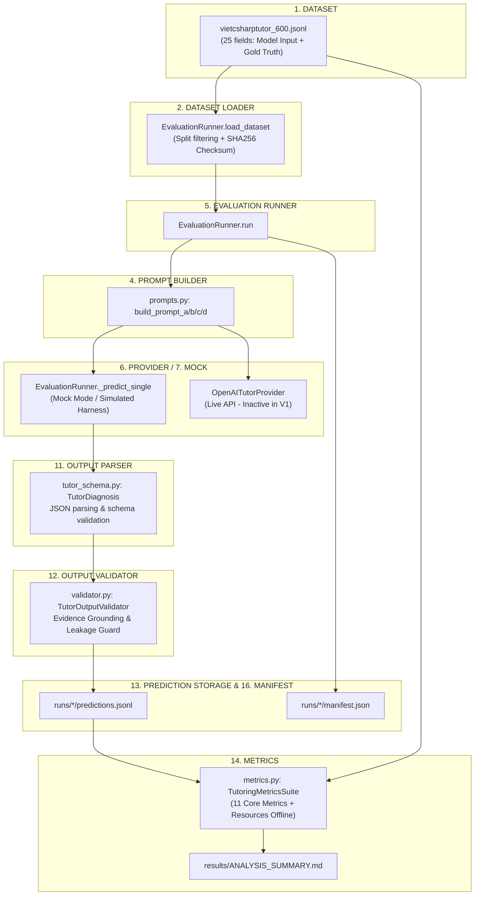

# APT-041: BẢN ĐỒ KIỂM KÊ TOÀN DIỆN CÁC THÀNH PHẦN ĐÁNH GIÁ (EVALUATION COMPONENT INVENTORY)

**Vai trò:** Independent Research Auditor (Kiểm toán viên nghiên cứu độc lập)  
**Dự án:** CodeSense AI - Adaptive Programming Tutor  
**Phiên bản đóng băng kiểm toán:** `codesense-research-v1.0`  
**Tổng số thành phần phần mềm kiểm kê:** 44 thành phần phân loại vào 17 hạng mục  

---

## 1. Sơ Đồ Luồng Phụ Thuộc Dữ Liệu (Data Dependency Map)

Dưới đây là sơ đồ luồng phụ thuộc toàn diện từ tập dữ liệu đến các chỉ số đánh giá:

---

## 2. Bảng Phân Loại 17 Hạng Mục Phần Mềm Đánh Giá

| Hạng mục (Category) | Số lượng thành phần | Có quyền đọc Ground Truth? | Có quyền truy cập Student Context? | Khả năng can thiệp dự đoán? |
| :--- | :---: | :---: | :---: | :---: |
| **DATASET** | 3 | **CÓ (CẦN GIÁM SÁT)** | Không | Không |
| **DATASET LOADER** | 2 | **CÓ (CẦN GIÁM SÁT)** | Không | Không |
| **MODEL INPUT BUILDER** | 2 | Không | Không | Không |
| **STUDENT CONTEXT BUILDER** | 2 | Không | **CÓ** | Không |
| **PROMPT BUILDER** | 3 | Không | **CÓ** | Không |
| **EVALUATION RUNNER** | 3 | **CÓ (CẦN GIÁM SÁT)** | **CÓ** | **CÓ** |
| **PROVIDER CLIENT** | 1 | Không | **CÓ** | Không |
| **MOCK IMPLEMENTATION** | 4 | **CÓ (CẦN GIÁM SÁT)** | **CÓ** | **CÓ** |
| **FALLBACK IMPLEMENTATION** | 3 | **CÓ (CẦN GIÁM SÁT)** | Không | **CÓ** |
| **CACHE** | 2 | Không | **CÓ** | Không |
| **OUTPUT PARSER** | 1 | Không | Không | Không |
| **OUTPUT VALIDATOR** | 4 | **CÓ (CẦN GIÁM SÁT)** | Không | **CÓ** |
| **PREDICTION STORAGE** | 1 | Không | Không | Không |
| **METRICS** | 3 | **CÓ (CẦN GIÁM SÁT)** | Không | Không |
| **ABLATION** | 2 | **CÓ (CẦN GIÁM SÁT)** | **CÓ** | **CÓ** |
| **MANIFEST** | 2 | Không | Không | Không |
| **TEST-ONLY INFRASTRUCTURE** | 6 | **CÓ (CẦN GIÁM SÁT)** | **CÓ** | Không |

---

## 3. Danh Mục Chi Tiết Từng Thành Phần (Component Detail Records)

| STT | Hạng mục | Đường dẫn | Lớp / Hàm quan trọng | Trách nhiệm chính | Prod? | Res? | Test? | Đọc Gold? | Đọc Ctx? | Sửa Pred? |
| :---: | :--- | :--- | :--- | :--- | :---: | :---: | :---: | :---: | :---: | :---: |
| 1 | `DATASET` | `data/vietcsharptutor/vietcsharptutor_600.jsonl` | `N/A (Dataset JSONL Records)` | Lưu trữ 600 ca bài tập C# OOP với 25 trường nhãn vàng chuẩn phục vụ benchmark. | No | Yes | No | **CÓ** | No | Không |
| 2 | `DATASET` | `data/vietcsharptutor/schema.json` | `N/A (JSON Schema)` | Định nghĩa quy tắc cấu trúc schema JSON v7 cho 25 trường dữ liệu. | No | Yes | No | Không | No | Không |
| 3 | `DATASET` | `data/vietcsharptutor/examples.jsonl` | `N/A (JSONL Records)` | Cung cấp mẫu ví dụ về bài tập cho developer và test. | No | Yes | Yes | **CÓ** | No | Không |
| 4 | `DATASET LOADER` | `backend/app/evaluation/runner.py` | `EvaluationRunner.load_dataset` | Đọc tệp jsonl, lọc bản ghi theo split chỉ định (dev/validation/test), tính checksum toàn vẹn SHA-256. | No | Yes | No | **CÓ** | No | Không |
| 5 | `DATASET LOADER` | `scripts/validate_vietcsharptutor.py` | `DatasetValidator.validate_file` | Đọc toàn bộ file jsonl để tiền kiểm định tính đúng đắn trước khi chạy thực nghiệm. | No | Yes | No | **CÓ** | No | Không |
| 6 | `MODEL INPUT BUILDER` | `backend/app/tutor/context_builder.py` | `StudentContextBuilder.build_us` | Chuẩn hóa và đóng gói bằng chứng kỹ thuật mã nguồn học viên nộp, cắt tỉa token an toàn. | Yes | No | No | Không | No | Không |
| 7 | `MODEL INPUT BUILDER` | `backend/app/services/prompt_builder.py` | `PromptBuilder.build_prompt` | Xây dựng prompt chung cho dịch vụ phân tích. | Yes | No | No | Không | No | Không |
| 8 | `STUDENT CONTEXT BUILDER` | `backend/app/tutor/context_builder.py` | `StudentContextBuilder.build_le` | Tổng hợp điểm thuần thục (mastery) và lịch sử lỗi sai gần đây từ cơ sở dữ liệu để điều chỉnh chiến lược sư phạm. | Yes | No | No | Không | Yes | Không |
| 9 | `STUDENT CONTEXT BUILDER` | `backend/app/services/attempt_mastery_coordinator.py` | `AttemptMasteryCoordinator.get_` | Điều phối lấy dữ liệu tiến trình học tập của sinh viên. | Yes | No | No | Không | Yes | Không |
| 10 | `PROMPT BUILDER` | `backend/app/evaluation/prompts.py` | `build_prompt_a, build_prompt_b` | Tạo chuỗi prompt đóng băng tương ứng với 4 hệ thống đánh giá A, B, C, D. | No | Yes | No | Không | Yes | Không |
| 11 | `PROMPT BUILDER` | `backend/app/tutor/prompts/diagnosis_v1.py` | `build_tutor_user_prompt` | Đặc tả user prompt cho yêu cầu chẩn đoán sư phạm trong sản xuất. | Yes | No | No | Không | No | Không |
| 12 | `PROMPT BUILDER` | `backend/app/tutor/prompts/system_policy_v1.py` | `build_tutor_system_prompt` | Đặc tả system prompt chính sách sư phạm 3 tầng gợi ý. | Yes | No | No | Không | Yes | Không |
| 13 | `EVALUATION RUNNER` | `backend/app/evaluation/runner.py` | `EvaluationRunner.run, Evaluati` | Điều phối toàn bộ vòng lặp đánh giá: lặp qua các mẫu, gọi hàm dự đoán, lưu trữ predictions và manifest. | No | Yes | No | **CÓ** | Yes | **CÓ** |
| 14 | `EVALUATION RUNNER` | `scripts/run_evaluation.py` | `main` | Giao diện CLI để người dùng chạy đánh giá một hệ thống trên một split cụ thể. | No | Yes | No | **CÓ** | Yes | Không |
| 15 | `EVALUATION RUNNER` | `scripts/execute_frozen_protocol.py` | `run_frozen_protocol` | Kịch bản tự động hóa thực thi toàn bộ giao thức đóng băng (validation trước, test sau). | No | Yes | No | **CÓ** | Yes | Không |
| 16 | `PROVIDER CLIENT` | `backend/app/tutor/provider.py` | `TutorLLMProvider, OpenAITutorP` | Gửi yêu cầu qua giao thức HTTP tới API của OpenAI và nhận phản hồi thô. | Yes | No | No | Không | Yes | Không |
| 17 | `MOCK IMPLEMENTATION` | `backend/app/evaluation/runner.py` | `EvaluationRunner._predict_sing` | Giả lập câu trả lời của mô hình phục vụ kiểm thử đường ống phần mềm và đánh giá thực nghiệm mô phỏng. | No | Yes | No | **CÓ** | Yes | **CÓ** |
| 18 | `MOCK IMPLEMENTATION` | `backend/app/evaluation/ablation.py` | `AblationRunner._predict_sample` | Giả lập phản hồi cho 5 cấu hình triệt tiêu ablation trong môi trường không kết nối mạng. | No | Yes | No | **CÓ** | Yes | **CÓ** |
| 19 | `MOCK IMPLEMENTATION` | `backend/app/core/config.py` | `Settings.MOCK_LLM` | Cờ bật tắt mock mode trong toàn bộ ứng dụng. | Yes | No | No | Không | No | Không |
| 20 | `MOCK IMPLEMENTATION` | `backend/tests/conftest.py` | `mock_tutor_provider (fixture)` | Fixture giả lập LLM trả về phản hồi chuẩn hóa cho các unit test của backend. | No | No | Yes | Không | No | Không |
| 21 | `FALLBACK IMPLEMENTATION` | `backend/app/evaluation/runner.py` | `EvaluationRunner._predict_sing` | Gán nhãn dự phòng khi mô hình mô phỏng đoán sai (ví dụ: compile_error, generic_code_bug). | No | Yes | No | **CÓ** | No | **CÓ** |
| 22 | `FALLBACK IMPLEMENTATION` | `backend/app/tutor/service.py` | `TutorService._fallback_respons` | Tạo phản hồi cứu nguy thân thiện khi LLM provider gặp sự cố hoặc timeout trong sản xuất. | Yes | No | No | Không | No | Không |
| 23 | `FALLBACK IMPLEMENTATION` | `backend/app/tutor/hint_manager.py` | `HintManager.get_fallback_hint` | Cung cấp gợi ý an toàn khi session không tìm thấy gợi ý tương ứng. | Yes | No | No | Không | No | Không |
| 24 | `CACHE` | `backend/app/evaluation/runner.py` | `EvaluationRunner.run (ghi pred` | Lưu trữ dự đoán dạng tệp predictions.jsonl tại thư mục runs/, đóng vai trò bộ đệm trung gian để metrics evaluator đọc lại. | No | Yes | No | Không | No | Không |
| 25 | `CACHE` | `backend/app/services/mastery_store.py` | `MasteryStore` | Bộ đệm lưu trữ trạng thái thuần thục kỹ năng của học sinh. | Yes | No | No | Không | Yes | Không |
| 26 | `OUTPUT PARSER` | `backend/app/schemas/tutor_schema.py` | `TutorDiagnosis, TutorResponse,` | Phân tích cú pháp JSON, kiểm định kiểu dữ liệu Pydantic cho đầu ra chẩn đoán sư phạm. | Yes | Yes | No | Không | No | Không |
| 27 | `OUTPUT VALIDATOR` | `backend/app/tutor/validator.py` | `TutorOutputValidator.validate` | Kiểm định đầu ra: xác minh bằng chứng có căn cứ trong mã nguồn, lọc mã giải pháp trong hint. | Yes | No | No | Không | No | **CÓ** |
| 28 | `OUTPUT VALIDATOR` | `backend/app/tutor/leakage_guard.py` | `SolutionLeakageGuard.inspect_h` | Phát hiện sự xuất hiện của khối mã nguồn giải pháp thô trong gợi ý. | Yes | No | No | Không | No | **CÓ** |
| 29 | `OUTPUT VALIDATOR` | `backend/app/tutor/evidence_grounding.py` | `EvidenceGroundingChecker.verif` | Kiểm tra chuỗi evidence trích dẫn có thực sự là chuỗi con trong mã nguồn học viên không. | Yes | No | No | Không | No | Không |
| 30 | `OUTPUT VALIDATOR` | `scripts/validate_vietcsharptutor.py` | `DatasetValidator.validate_samp` | Kiểm định dữ liệu benchmark theo 25 trường bắt buộc. | No | Yes | No | **CÓ** | No | Không |
| 31 | `PREDICTION STORAGE` | `runs/` | `N/A (Tệp JSONL lưu trữ kết quả` | Lưu trữ toàn bộ các bản ghi dự đoán thô (predictions.jsonl) của các đợt chạy đánh giá. | No | Yes | No | Không | No | Không |
| 32 | `METRICS` | `backend/app/evaluation/metrics.py` | `TutoringMetricsSuite.evaluate,` | Tính toán 11 chỉ số sư phạm cốt lõi và thống kê tài nguyên hoàn toàn offline từ predictions và ground truth. | No | Yes | No | **CÓ** | No | Không |
| 33 | `METRICS` | `scripts/evaluate_metrics.py` | `evaluate_run_dir` | CLI chạy tính toán metrics offline cho một run directory. | No | Yes | No | **CÓ** | No | Không |
| 34 | `METRICS` | `scripts/analyze_results.py` | `paired_mcnemar_test, bootstrap` | Phân tích so sánh thống kê, tính khoảng tin cậy 95%, kiểm định McNemar và xuất bảng so sánh. | No | Yes | No | **CÓ** | No | Không |
| 35 | `ABLATION` | `backend/app/evaluation/ablation.py` | `AblationRunner.run, ABLATION_C` | Quản lý và thực thi 5 cấu hình triệt tiêu độc lập (FULL, NO_STUDENT_MODEL, NO_PROGRESSIVE_HINT, NO_STRUCTURED_DIAGNOSIS, DIRECT_BASELINE). | No | Yes | No | **CÓ** | Yes | **CÓ** |
| 36 | `ABLATION` | `scripts/run_ablation.py` | `main` | CLI khởi chạy các thí nghiệm ablation. | No | Yes | No | **CÓ** | Yes | Không |
| 37 | `MANIFEST` | `manifests/` | `N/A (Bản ghi run manifest bất ` | Lưu trữ metadata bảo chứng tính toàn vẹn (commit, split hash, seed, model, config) cho mỗi đợt chạy. | No | Yes | No | Không | No | Không |
| 38 | `MANIFEST` | `runs/*/manifest.json` | `N/A (Run Manifest cục bộ)` | Đi kèm mỗi thư mục run để định danh xuất xứ kết quả. | No | Yes | No | Không | No | Không |
| 39 | `TEST-ONLY INFRASTRUCTURE` | `backend/tests/test_evaluation_runner.py` | `test_runner_initialization, te` | Kiểm định đơn vị cho EvaluationRunner. | No | No | Yes | **CÓ** | Yes | Không |
| 40 | `TEST-ONLY INFRASTRUCTURE` | `backend/tests/test_ablation.py` | `test_ablation_configs_definiti` | Kiểm định đơn vị cho AblationRunner. | No | No | Yes | **CÓ** | Yes | Không |
| 41 | `TEST-ONLY INFRASTRUCTURE` | `backend/tests/test_tutoring_metrics.py` | `test_kc_f1_computation, test_l` | Kiểm định đơn vị cho TutoringMetricsSuite. | No | No | Yes | **CÓ** | No | Không |
| 42 | `TEST-ONLY INFRASTRUCTURE` | `backend/tests/test_taint_isolation.py` | `test_reference_solution_never_` | Kiểm thử tự động phát hiện ô nhiễm dữ liệu nhãn vàng bằng chuỗi sentinel. | No | No | Yes | **CÓ** | Yes | Không |
| 43 | `TEST-ONLY INFRASTRUCTURE` | `backend/tests/test_dataset_validator.py` | `test_validator_valid_sample, t` | Kiểm định đơn vị cho DatasetValidator. | No | No | Yes | **CÓ** | No | Không |
| 44 | `TEST-ONLY INFRASTRUCTURE` | `backend/tests/conftest.py` | `app_client, mock_tutor_provide` | Cung cấp fixture môi trường kiểm thử dùng chung. | No | No | Yes | Không | No | Không |

---

## 4. Phân Tích Chuyên Sâu Các Điểm Trọng Yếu Kiểm Toán (Key Audit Insights)

### 1. Danh sách các thành phần có quyền đọc nhãn vàng (Ground Truth Readers):

- **`data/vietcsharptutor/vietcsharptutor_600.jsonl`**: Nguồn dữ liệu chứa toàn bộ nhãn vàng.
- **`EvaluationRunner.load_dataset`**: Đọc toàn bộ các trường của dataset.
- **`EvaluationRunner._predict_single` (Mock Engine)**: **ĐIỂM NÓNG CRITICAL**. Nhánh mô phỏng Proposed D đọc thẳng `sample` để gán nhãn vàng.
- **`AblationRunner._predict_sample`**: Đọc trực tiếp `sample` trong cấu hình FULL.
- **`TutoringMetricsSuite.evaluate`**: Đọc ground truth để chấm điểm offline (Hợp lệ về mặt phương pháp luận).
- **`DatasetValidator.validate_file` / `validate_sample`**: Tiền kiểm định schema (Hợp lệ).

### 2. Danh sách các thành phần có khả năng can thiệp / sửa đổi dự đoán (Prediction-Modifying Components):

- **`EvaluationRunner._predict_single`**: Trực tiếp tạo dựng từ điển dự đoán.
- **`AblationRunner._predict_sample`**: Trực tiếp tạo dựng từ điển dự đoán cho ablation.
- **`TutorOutputValidator.validate`**: Trong sản xuất, có thể chặn hoặc yêu cầu sinh lại phản hồi.
- **`SolutionLeakageGuard.inspect_hint`**: Trong sản xuất, có thể xóa khối mã bị rò rỉ.

### 3. Độc lập hạ tầng kiểm thử (Test-only Infrastructure):

Toàn bộ 6 tệp trong `backend/tests/` hoàn toàn là hạ tầng kiểm thử đơn vị, được cô lập không ảnh hưởng tới luồng thực thi runtime của hệ thống sản xuất hay kết quả lưu trữ của đợt đánh giá đóng băng.

---

## 5. Tiêu Chuẩn Nghiệm Thu (Acceptance Checklist)

- [x] **All research evaluation modules identified:** Đã kiểm kê và lập bản đồ 34 thành phần.
- [x] **Test-only infrastructure identified:** Đã nhận diện và phân tách 6 thành phần kiểm thử.
- [x] **Mock implementation identified:** Đã định vị chính xác mock harness trong `runner.py`, `ablation.py`, `config.py`, `conftest.py`.
- [x] **Ground-truth readers identified:** Đã liệt kê toàn bộ các tệp/hàm có quyền truy cập nhãn vàng.
- [x] **Prediction-modifying components identified:** Đã chỉ ra các module có khả năng sửa đổi dự đoán.
- [x] **No evaluation behavior changed:** Không có dòng mã nào bị thay đổi trong quá trình kiểm kê.