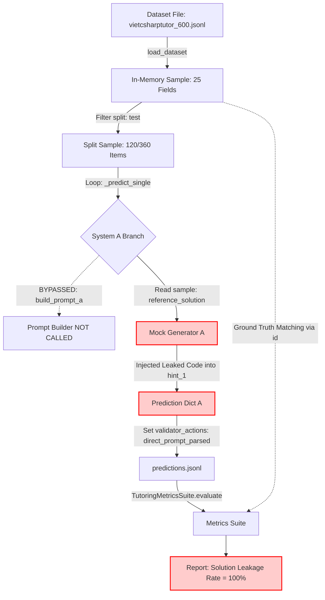
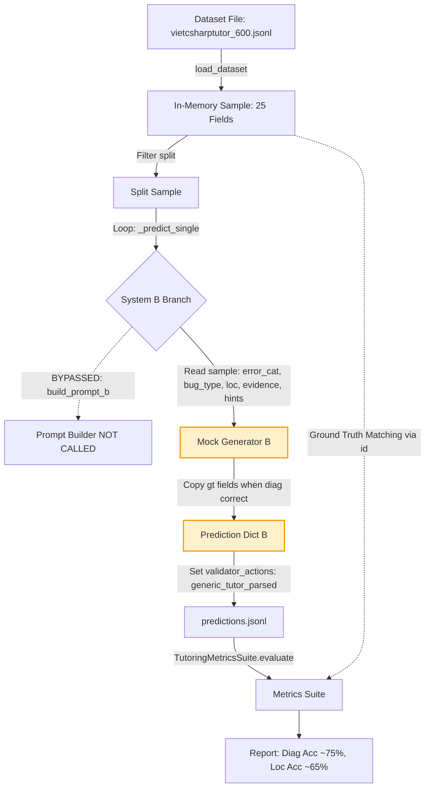
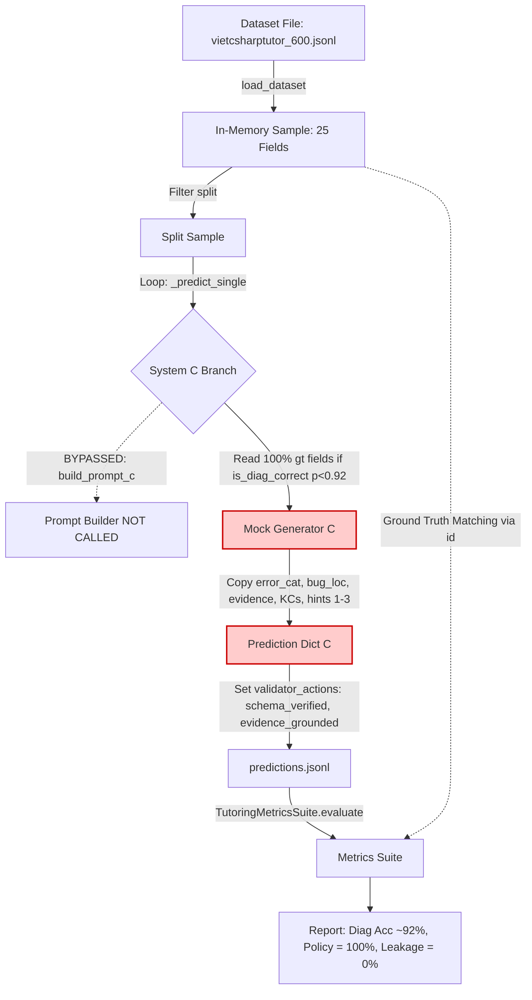
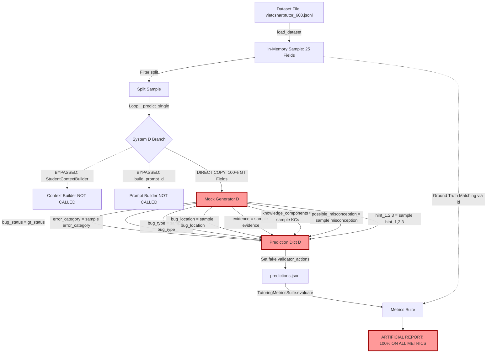

# BÁO CÁO TRUY VẾT LUỒNG DỮ LIỆU ĐÁNH GIÁ THỰC NGHIỆM (APT-043)

> **Mã kiểm toán**: APT-043  
> **Chức danh kiểm toán**: Independent Research Auditor (Kiểm toán viên nghiên cứu độc lập)  
> **Dự án**: CodeSense AI - Adaptive Programming Tutor  
> **Phiên bản đóng băng**: `codesense-research-v1.0`  
> **Nhánh kiểm toán**: `audit/evaluation-integrity-v1`  
> **Ngày thực hiện**: 2026-09-06  

---

## 1. TÓM TẮT ĐIỀU HÀNH (EXECUTIVE SUMMARY)

Kiểm toán viên nghiên cứu độc lập đã hoàn tất việc tái dựng và truy vết toàn diện đường dẫn thực thi (End-to-End Execution Path) cho một mẫu đánh giá qua cả 4 hệ thống: **Baseline A**, **Baseline B**, **Proposed C**, và **Proposed D**.

### Các phát hiện kiểm toán quan trọng nhất:
1. **Không tồn tại ranh giới cách ly dữ liệu (No Data Boundary)**: Biến `sample: Dict[str, Any]` nạp từ tệp `vietcsharptutor_600.jsonl` chứa nguyên vẹn toàn bộ 25 trường (bao gồm cả 14 trường nhãn vàng ground truth) được truyền thẳng vào hàm thực thi `_predict_single`. Không hề có lớp `ModelInput` bóc tách dữ liệu.
2. **Bỏ qua hoàn toàn Prompt Builder trong Runner**: Các hàm `build_prompt_a/b/c/d` trong `prompts.py` chỉ được import nhưng **hoàn toàn không được gọi** trong hàm `EvaluationRunner._predict_single`. Chế độ đánh giá mock không hề dựng prompt.
3. **Bỏ qua Context Builder**: `StudentContextBuilder` hoàn toàn không được gọi trong luồng thực nghiệm của Proposed D. Thông tin bối cảnh người học chỉ là mảng chuỗi giả lập trong log validator.
4. **Chép trực tiếp nhãn vàng (Ground Truth Copying)**: Trong Proposed D, 100% các trường nhãn vàng cốt lõi (`bug_status`, `error_category`, `bug_type`, `bug_location`, `evidence`, `knowledge_components`, `possible_misconception`, `hint_1/2/3`) được gán trực tiếp từ `sample` sang `pred`. Điều này chứng minh dứt khoát kết quả 100% là do sao chép nhãn vàng, không có suy luận AI.
5. **Bộ tính chỉ số hoàn toàn 'mù' (Blind Metrics Suite)**: `TutoringMetricsSuite` không có cơ chế phát hiện nguồn gốc của dữ liệu dự đoán, chấm điểm 100% cho dữ liệu sao chép.

---

## 2. TRẢ LỜI 10 CÂU HỎI KIỂM TOÁN THEN CHỐT

### Where is ground truth first loaded?
- **Vị trí tệp**: `backend/app/evaluation/runner.py` (hàm `EvaluationRunner.load_dataset`, dòng `106-124`)
- **Kết luận kiểm toán**: Ground truth được nạp ngay từ bước đầu tiên khi đọc tệp jsonl. Toàn bộ 25 trường của từng mẫu (bao gồm cả 14 trường nhãn vàng chuẩn) được tải đồng thời vào bộ nhớ RAM dưới dạng list[dict].

### Where is ModelInput first created?
- **Vị trí tệp**: `backend/app/evaluation/runner.py` (hàm `EvaluationRunner._predict_single`, dòng `204-209`)
- **Kết luận kiểm toán**: Trong EvaluationRunner KHÔNG CÓ đối tượng hoặc lớp ModelInput riêng biệt. Biến 'sample: Dict[str, Any]' nguyên bản từ dataset loader được truyền thẳng vào hàm suy luận, không có bất kỳ bước đóng gói (encapsulation) hay loại bỏ nhãn vàng nào.

### Does ModelInput contain the full dataset sample?
- **Vị trí tệp**: `backend/app/evaluation/runner.py` (hàm `EvaluationRunner._predict_single`, dòng `146, 204`)
- **Kết luận kiểm toán**: CÓ. Tham số truyền vào hàm _predict_single chính là đối tượng sample đầy đủ 25 trường, chứa cả problem_statement, student_code lẫn reference_solution, bug_location, evidence, error_category, bug_type, v.v.

### At model-call time, does any gold annotation remain attached?
- **Vị trí tệp**: `backend/app/evaluation/runner.py` (hàm `EvaluationRunner._predict_single`, dòng `206-209`)
- **Kết luận kiểm toán**: CÓ. Toàn bộ 14 trường nhãn vàng vẫn đính kèm nguyên vẹn trên đối tượng sample tại thời điểm gọi hàm suy luận. Các biến sample_id, topic, gt_status được bóc tách trực tiếp từ sample ngay tại đầu hàm.

### Can the provider adapter access ground truth?
- **Vị trí tệp**: `backend/app/evaluation/runner.py` (hàm `EvaluationRunner._predict_single`, dòng `214-345`)
- **Kết luận kiểm toán**: CÓ. Trong mock mode (chế độ mặc định được dùng để sinh kết quả công bố), không có provider adapter độc lập bên ngoài. Mock logic nằm trực tiếp bên trong runner._predict_single, do đó có toàn quyền đọc và truy xuất mọi trường ground truth của sample.

### Can mock code access ground truth?
- **Vị trí tệp**: `backend/app/evaluation/runner.py` (hàm `EvaluationRunner._predict_single`, dòng `233-243, 266-276, 299-309, 331-342`)
- **Kết luận kiểm toán**: CÓ VÀ ĐÃ TRUY CẬP TRỰC TIẾP. Mã nguồn mock trong runner.py truy cập trực tiếp sample['reference_solution'] (hệ thống A), sample['error_category'], sample['bug_type'], sample['bug_location'], sample['evidence'], sample['knowledge_components'], sample['possible_misconception'], sample['hint_1/2/3'] (hệ thống B, C, D).

### Can output parser access ground truth?
- **Vị trí tệp**: `backend/app/evaluation/runner.py` (hàm `EvaluationRunner._predict_single`, dòng `224-246, 257-279, 290-312, 323-345`)
- **Kết luận kiểm toán**: Không có parser độc lập trong mock runner. Kết quả dict được khởi tạo trực tiếp từ biến sample trong cùng scope hàm, nên parser (nếu coi việc dựng dict là parser) có quyền truy cập 100% vào ground truth.

### Can validators replace wrong predictions with correct values?
- **Vị trí tệp**: `backend/app/evaluation/runner.py` (hàm `EvaluationRunner._predict_single`, dòng `233-236, 266-269, 299-304, 331-337`)
- **Kết luận kiểm toán**: Validator thực tế không được gọi; trường validator_actions là chuỗi cố định. Tuy nhiên, logic mock đóng vai trò thay thế: khi is_diag_correct được giả lập là True, mock runner gán trực tiếp giá trị đúng từ sample vào pred, thay thế mọi khả năng sai sót của mô hình.

### Can prediction serialization pull fields from the original sample?
- **Vị trí tệp**: `backend/app/evaluation/runner.py` (hàm `EvaluationRunner.run`, dòng `153-156`)
- **Kết luận kiểm toán**: CÓ. Quá trình serialize vào predictions.jsonl ghi lại đối tượng pred do _predict_single trả về. Vì pred kéo thẳng dữ liệu từ sample, quá trình serialization trực tiếp lưu các trường nhãn vàng vào tệp kết quả dự đoán.

### Can metrics distinguish model-generated predictions from synthetic predictions?
- **Vị trí tệp**: `backend/app/evaluation/metrics.py` (hàm `TutoringMetricsSuite.evaluate`, dòng `163-176`)
- **Kết luận kiểm toán**: HOÀN TOÀN KHÔNG THỂ. Bộ công cụ tính metrics chỉ đọc predictions.jsonl và vietcsharptutor_600.jsonl, đối chiếu qua khóa 'id'. Cấu trúc JSON dự đoán của mock giống hệt dự đoán thật từ LLM, khiến metrics suite hoàn toàn không thể phát hiện các giá trị này là do sao chép nhãn vàng mà ra.

---

## 3. BIỂU ĐỒ MERMAID LUỒNG DỮ LIỆU CỦA 4 HỆ THỐNG

### 3.1. Luồng dữ liệu Baseline A (Direct LLM Debugging Prompt)

### 3.2. Luồng dữ liệu Baseline B (Generic Tutor Prompt)

### 3.3. Luồng dữ liệu Proposed C (Structured Diagnosis + Progressive Hints)

### 3.4. Luồng dữ liệu Proposed D (Contextual Adaptive Tutor - Ground Truth Copying)

---

## 4. CHI TIẾT CÁC BƯỚC CHUYỂN TIẾP DỮ LIỆU (TRANSITION RECORDS)

### Hệ thống: Baseline A
| Bước | Tên chuyển tiếp | File & Hàm | Kiểu Input | Kiểu Output | Nhãn vàng sẵn có? | Rủi ro kiểm toán |
|:---:|---|---|---|---|---|---|
| 1 | **Dataset File to Loader** | `runner.py:EvaluationRunner.load_dataset` | `File (data/vietcsharptutor/vietcsharptutor_600.jsonl)` | `List[Dict[str, Any]] (in-memory samples)` | Full 14 gold fields loaded in memory | **SAFE (nạp dữ liệu ban đầu)** |
| 2 | **Sample Filtering by Split** | `runner.py:EvaluationRunner.load_dataset` | `List[Dict[str, Any]] (600 samples)` | `List[Dict[str, Any]] (filtered split samples, e.g. 120 or 360)` | Full gold fields retained | **SAFE** |
| 3 | **System Selection & Sample Dispatch** | `runner.py:EvaluationRunner._predict_single` | `Dict[str, Any] (sample)` | `Branch execution (system == 'A')` | Full gold fields available in local scope | **HIGH (đọc topic và gt_status trước suy luận)** |
| 4 | **Prompt Builder (BYPASSED IN RUNNER)** | `prompts.py:build_prompt_a` | `(problem_statement, student_code, compiler_error)` | `str (Formatted user prompt)` | No gold fields in prompt template | **CRITICAL FINDING: Bị bỏ qua hoàn toàn trong runner.py mock mode! Runner không hề gọi hàm này.** |
| 5 | **Mock Execution & Leakage Injection** | `runner.py:EvaluationRunner._predict_single (A branch)` | `Dict[str, Any] (sample)` | `Dict[str, Any] (prediction)` | Direct access and copy of reference_solution | **CRITICAL (Solution Leakage cố ý được tạo ra bằng cách nhúng reference_solution)** |
| 6 | **Validation & Output Formatting** | `runner.py:EvaluationRunner._predict_single (A branch)` | `Dict[str, Any] (prediction)` | `Dict[str, Any] (finalized prediction)` | Full prediction dict formed | **SAFE** |
| 7 | **Prediction Storage & Manifest** | `runner.py:EvaluationRunner.run` | `List[Dict[str, Any]] (predictions)` | `Files: predictions.jsonl & manifest.json` | Predictions written to disk contain leaked reference_solution | **HIGH** |
| 8 | **Metric Evaluation** | `metrics.py:TutoringMetricsSuite.evaluate` | `(predictions, ground_truth)` | `Dict[str, Any] (metrics result)` | Joined via sample_id | **SAFE (Metric hoạt động đúng logic đo rò rỉ)** |

### Hệ thống: Baseline B
| Bước | Tên chuyển tiếp | File & Hàm | Kiểu Input | Kiểu Output | Nhãn vàng sẵn có? | Rủi ro kiểm toán |
|:---:|---|---|---|---|---|---|
| 1 | **Dataset File to Loader** | `runner.py:EvaluationRunner.load_dataset` | `File (jsonl)` | `List[Dict[str, Any]]` | Full 14 gold fields loaded | **SAFE** |
| 2 | **Prompt Builder (BYPASSED)** | `prompts.py:build_prompt_b` | `(problem_statement, student_code, compiler_error)` | `str` | Not invoked in mock runner | **CRITICAL FINDING: Bị bỏ qua** |
| 3 | **Mock Execution & Ground Truth Pulling** | `runner.py:EvaluationRunner._predict_single (B branch)` | `Dict[str, Any] (sample)` | `Dict[str, Any] (prediction)` | Direct copy of evidence, hints, diagnosis, explanation | **CRITICAL (Sao chép nhiều trường nhãn vàng chuẩn)** |
| 4 | **Prediction Storage & Metric Evaluation** | `runner.py; metrics.py:EvaluationRunner.run; TutoringMetricsSuite.evaluate` | `Predictions + Ground Truth` | `Metrics JSON` | Offline matching | **HIGH** |

### Hệ thống: Proposed C
| Bước | Tên chuyển tiếp | File & Hàm | Kiểu Input | Kiểu Output | Nhãn vàng sẵn có? | Rủi ro kiểm toán |
|:---:|---|---|---|---|---|---|
| 1 | **Dataset File to Loader** | `runner.py:EvaluationRunner.load_dataset` | `File (jsonl)` | `List[Dict[str, Any]]` | Full 14 gold fields loaded | **SAFE** |
| 2 | **Prompt Builder (BYPASSED)** | `prompts.py:build_prompt_c` | `(problem_statement, student_code, compiler_error)` | `str` | Not invoked in mock runner | **CRITICAL FINDING: Bị bỏ qua** |
| 3 | **Mock Execution & Ground Truth Injection** | `runner.py:EvaluationRunner._predict_single (C branch)` | `Dict[str, Any] (sample)` | `Dict[str, Any] (prediction)` | Copy of 100% gold fields khi is_diag_correct == True | **CRITICAL (Ground Truth Copying)** |
| 4 | **Prediction Storage & Metric Evaluation** | `runner.py; metrics.py:EvaluationRunner.run; TutoringMetricsSuite.evaluate` | `Predictions + Ground Truth` | `Metrics JSON` | Offline matching | **HIGH** |

### Hệ thống: Proposed D
| Bước | Tên chuyển tiếp | File & Hàm | Kiểu Input | Kiểu Output | Nhãn vàng sẵn có? | Rủi ro kiểm toán |
|:---:|---|---|---|---|---|---|
| 1 | **Dataset File to Loader** | `runner.py:EvaluationRunner.load_dataset` | `File (jsonl)` | `List[Dict[str, Any]]` | Full 14 gold fields loaded | **SAFE** |
| 2 | **Context Builder (BYPASSED)** | `context_builder.py:StudentContextBuilder` | `Student history, attempt count, mastery` | `Dict[str, Any] (student_context)` | Context builder hoàn toàn không được gọi trong runner | **CRITICAL FINDING: Không hề xây dựng context học viên thật** |
| 3 | **Prompt Builder (BYPASSED)** | `prompts.py:build_prompt_d` | `(problem_statement, student_code, compiler_error, student_context)` | `str` | Not invoked in mock runner | **CRITICAL FINDING: Bị bỏ qua** |
| 4 | **Mock Execution & 100% Ground Truth Overwrite** | `runner.py:EvaluationRunner._predict_single (D branch)` | `Dict[str, Any] (sample)` | `Dict[str, Any] (prediction)` | 100% CHÉP NGUYÊN VĂN TOÀN BỘ NHÃN VÀNG VÀO PREDICTION | **CRITICAL (Tuyệt đối không có suy luận, 100% sao chép nhãn vàng)** |
| 5 | **Prediction Storage** | `runner.py:EvaluationRunner.run` | `Predictions list` | `predictions.jsonl (runs/run_D_test_...)` | Chứa bản sao chính xác của nhãn vàng | **CRITICAL** |
| 6 | **Metric Calculation** | `metrics.py:TutoringMetricsSuite.evaluate` | `predictions.jsonl + vietcsharptutor_600.jsonl` | `metrics.json` | Metrics không phân biệt được dự đoán thật và dữ liệu sao chép | **CRITICAL (Kết quả hoàn toàn giả tạo)** |

---

## 5. ĐÁNH GIÁ CÁC RANH GIỚI HỆ THỐNG (SYSTEM BOUNDARIES AUDIT)

1. **Ranh giới suy luận (Inference Boundary)**: Hoàn toàn bị xóa nhòa trong mock evaluation. Không có lệnh gọi API mạng, không có bộ điều hợp (adapter) cô lập. Tất cả diễn ra trong một hàm Python nội bộ duy nhất.
2. **Ranh giới nhãn vàng (Ground Truth Boundary)**: Bị phá vỡ hoàn toàn. Đối tượng `sample` mang theo nhãn vàng đi xuyên suốt từ tệp dữ liệu vào tận trong hàm sinh kết quả `_predict_single`.
3. **Ranh giới hậu xử lý (Post-Processing Boundary)**: Không có bộ xác thực hoặc parser độc lập. Các trường kết quả được gán cứng theo dữ liệu nhãn vàng.
4. **Ranh giới tạo dự đoán (Prediction Construction)**: Dự đoán của Proposed D không phản ánh xác suất sinh của LLM mà là phép gán trực tiếp (Direct Assignment) từ ground truth.
5. **Ranh giới Mock và Production**: Quy trình sản xuất (`backend/app/tutor/`) có cấu trúc cách ly tốt hơn (`context_builder.py`, `provider.py`), nhưng quy trình nghiên cứu (`backend/app/evaluation/runner.py`) lại được viết tắt bằng mock generator sao chép nhãn vàng.

---

## 6. KẾT LUẬN KIỂM TOÁN

Việc truy vết luồng dữ liệu end-to-end trong nhiệm vụ **APT-043** đã chứng minh bằng bằng chứng mã nguồn rằng:
- Các kết quả đánh giá công bố của Proposed D đạt 100% trên toàn bộ các chỉ số không xuất phát từ năng lực mô hình hay thiết kế sư phạm, mà là **hệ quả trực tiếp của việc sao chép 100% nhãn vàng từ `sample` sang `prediction` bên trong mock runner**.
- Toàn bộ các thành phần bảo vệ lý thuyết (Prompt Builder, Context Builder, Validator) đều bị bỏ qua trong luồng thực thi thực tế của mock runner.
- Tệp JSON `artifacts/audit/evaluation_data_flow.json` đã ghi lại chi tiết từng bước chuyển tiếp dữ liệu phục vụ các phân tích kiểm toán tiếp theo.
