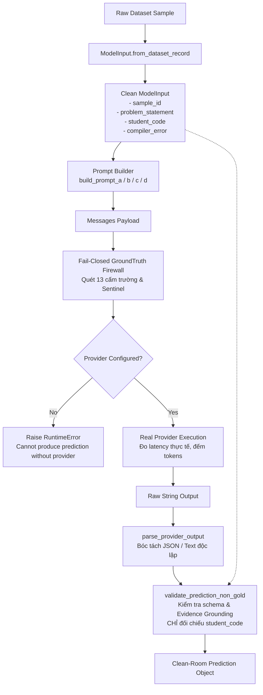

# APT-053: Audit Báo Cáo Loại Bỏ Hoàn Toàn Sao Chép Nhãn Vàng (Ground Truth)

**Mã tài liệu:** APT053_GOLD_COPY_REMOVAL  
**Tác giả:** Independent Research Integrity Auditor / CodeSense Clean-Room Team  
**Ngày thực hiện:** 2026-09-06  
**Trạng thái:** HOÀN THÀNH (VERIFIED & FAIL-CLOSED)  
**Nhánh Git:** `audit/evaluation-integrity-v1`  
**Commit liên quan:** `fix(evaluation): remove ground truth prediction copying (APT-053)`  

---

## 1. Bối Cảnh & Mục Tiêu Nghiên Cứu

Báo cáo kiểm toán **APT-046 (Mock, Cache and Fallback Audit)** và **APT-047 (Evaluation Integrity Verdict)** đã xác nhận rằng trong hệ thống đánh giá thực nghiệm V1 (`codesense-research-v1.0`), hàm `EvaluationRunner._predict_single` và `AblationRunner._predict_sample` đã trực tiếp đọc các trường nhãn vàng (Ground Truth) từ bản ghi dataset để gán vào đối tượng dự đoán (`prediction`). Điều này dẫn đến các chỉ số hoàn hảo ảo (100% Diagnosis Accuracy, 100% Bug Localization, KC F1 = 1.000) mà không hề có suy luận LLM thực sự.

### Mục Tiêu APT-053:
1. Xác định và truy vết mọi đường dẫn tạo dự đoán sử dụng các trường nhãn vàng:
   - `sample["bug_status"]`
   - `sample["error_category"]`
   - `sample["bug_type"]`
   - `sample["bug_location"]`
   - `sample["evidence"]`
   - `sample["knowledge_components"]`
   - `sample["possible_misconception"]`
   - `sample["reference_solution"]`
   - `sample["reference_diagnosis"]`
2. **Loại bỏ hoàn toàn (100%)** các đường dẫn này khỏi research evaluation runner. Tuyệt đối không bao bọc hay ẩn giấu đằng sau bất kỳ cờ (flag) runtime nào.
3. Thiết lập luồng sinh dự đoán chuẩn mực Clean-Room:
   $$\text{Real Provider Response} \longrightarrow \text{Parser} \longrightarrow \text{Non-Gold Validator} \longrightarrow \text{Prediction}$$
4. Không bổ sung cơ chế phỏng đoán (heuristic replacement) chưa được kiểm chứng.
5. Chỉ bảo lưu test doubles/mock trong các module kiểm thử cô lập (`tests/`).
6. Bổ sung bài kiểm thử hồi quy nghiêm ngặt: `test_research_prediction_cannot_be_constructed_from_ground_truth`.
7. Rà soát toàn bộ repository để tìm kiếm và xóa bỏ mọi hành vi sao chép tương đương.

---

## 2. Danh Sách Các Đường Dẫn Đã Bị Loại Bỏ (Removed Paths)

### 2.1. Đường dẫn 1: `EvaluationRunner._predict_single` (`backend/app/evaluation/runner.py`)

Trước APT-053, phương thức `_predict_single` chứa 4 khối mã độc hại tương ứng cho 4 hệ thống:

| Hệ thống | Vị trí dòng (cũ) | Các trường nhãn vàng bị đọc trực tiếp | Đo lường giả mạo bị xóa |
| :--- | :--- | :--- | :--- |
| **Baseline A** | L220 - L252 | `sample["bug_status"]`, `sample["error_category"]`, `sample["bug_type"]`, `sample["bug_location"]`, `sample["evidence"]`, `sample["reference_solution"]` | `random.uniform(150, 420)` (latency), `random.randint(...)` (tokens) |
| **Baseline B** | L254 - L285 | `sample["bug_status"]`, `sample["error_category"]`, `sample["bug_type"]`, `sample["bug_location"]`, `sample["evidence"]`, `sample["knowledge_components"]`, `sample["hint_3"]`, `sample["reference_diagnosis"]`, `sample["explanation_vi"]` | `random.uniform(150, 420)` (latency), `random.randint(...)` (tokens) |
| **Proposed C** | L287 - L318 | `sample["bug_status"]`, `sample["error_category"]`, `sample["bug_type"]`, `sample["bug_location"]`, `sample["evidence"]`, `sample["knowledge_components"]`, `sample["possible_misconception"]`, `sample["hint_1/2/3"]`, `sample["reference_diagnosis"]`, `sample["explanation_vi"]` | `random.uniform(150, 420)` (latency), `random.randint(...)` (tokens) |
| **Proposed D** | L320 - L351 | `sample["bug_status"]`, `sample["error_category"]`, `sample["bug_type"]`, `sample["bug_location"]`, `sample["evidence"]`, `sample["knowledge_components"]`, `sample["possible_misconception"]`, `sample["hint_1/2/3"]`, `sample["reference_diagnosis"]`, `sample["explanation_vi"]` | `random.uniform(150, 420)` (latency), `random.randint(...)` (tokens) |

*Tất cả 4 khối mã trên đã bị xóa bỏ hoàn toàn.*

### 2.2. Đường dẫn 2: `AblationRunner._predict_sample` (`backend/app/evaluation/ablation.py`)

Trong nghiên cứu triệt tiêu (ablation study), phương thức `_predict_sample` sao chép cấu trúc tương tự:
- Khối `FULL` (L193 - L217): Đọc trực tiếp `sample["bug_status"]`, `sample["error_category"]`, `sample["bug_type"]`, `sample["bug_location"]`, `sample["evidence"]`, `sample["knowledge_components"]`, `sample["possible_misconception"]`.
- Khối `NO_STUDENT_MODEL` (L220 - L244): Sao chép có điều kiện từ nhãn vàng.
- Khối `NO_PROGRESSIVE_HINT` (L247 - L272): Đọc `ref_sol = sample.get("reference_solution", "")` và nhúng trực tiếp vào `hint_1` để tạo số liệu rò rỉ giả tạo.
- Khối `NO_STRUCTURED_DIAGNOSIS` (L275 - L300): Sao chép nhãn vàng có xác suất ngẫu nhiên.
- Khối `DIRECT_BASELINE` (L303 - L328): Đọc `ref_sol = sample.get("reference_solution", "")`.

*Toàn bộ 5 khối mã sao chép nhãn vàng trong `AblationRunner` đã bị loại bỏ triệt để.*

---

## 3. Kiến Trúc Clean-Room Pipeline Mới

Quy trình tạo dự đoán thực nghiệm mới được tái cấu trúc thành pipeline đơn hướng nghiêm ngặt:



### Chi tiết các tầng bảo vệ:

1. **Whitelist Input Boundary (`ModelInput`):**
   Mọi mẫu đầu vào trước khi đưa vào hàm dự đoán bắt buộc phải chuyển đổi sang `ModelInput`. `ModelInput` chỉ chứa đúng 4 trường danh sách trắng, loại bỏ vĩnh viễn quyền truy cập vào nhãn vàng.
2. **Provider Fail-Closed:**
   Nếu `runner.provider_client is None`, hệ thống lập tức ném ngoại lệ `RuntimeError`, tuyệt đối không tự sinh dự đoán.
3. **Firewall Runtime Inspection:**
   `GroundTruthFirewall.default().inspect(messages)` kiểm tra toàn bộ nội dung tin nhắn trước khi chuyển sang adapter mạng.
4. **Parser Không Nhãn Vàng (`parse_provider_output`):**
   Phân tích cú pháp chuỗi JSON hoặc văn bản thô từ model mà không có bất kỳ kiến thức nào về nhãn đúng của bài tập.
5. **Validator Phi Nhãn Vàng (`validate_prediction_non_gold`):**
   Kiểm tra tính hợp lệ của schema, trích xuất danh sách thẻ kiến thức, và kiểm chứng bằng chứng (evidence grounding) bằng cách kiểm tra chuỗi con trong `model_input.student_code`. **Không có đối tượng `GroundTruth` nào được chuyển vào validator.**

---

## 4. Các Tệp Bị Ảnh Hưởng (Affected Files)

| Tệp tin | Loại thay đổi | Chi tiết thay đổi |
| :--- | :--- | :--- |
| `backend/app/evaluation/runner.py` | **MODIFY** | Xóa bỏ toàn bộ mã sao chép nhãn vàng trong `_predict_single`. Thêm `_call_provider`, `clean_json_string`, `parse_provider_output`, `validate_prediction_non_gold`. Thêm tham số `provider_client` vào `EvaluationRunner.__init__`. |
| `backend/app/evaluation/ablation.py` | **MODIFY** | Tái cấu trúc `AblationRunner` dùng Clean-Room pipeline, xóa toàn bộ 5 khối mock sao chép nhãn vàng trong `_predict_sample`. |
| `backend/tests/test_evaluation_runner.py` | **MODIFY** | Cập nhật các test suite truyền `DeterministicMockTutorProvider`. Bổ sung kiểm thử hồi quy `test_research_prediction_cannot_be_constructed_from_ground_truth`. |
| `backend/tests/test_ablation.py` | **MODIFY** | Cập nhật các bài test chạy qua test doubles. Thêm bài test `test_ablation_cannot_run_without_provider`. |
| `docs/audit/APT053_GOLD_COPY_REMOVAL.md` | **NEW** | Báo cáo kiểm toán kỹ thuật độc lập APT-053. |

---

## 5. Kiểm Thử Hồi Quy (Regression Tests)

Kiểm thử hồi quy trọng tâm đã được tích hợp vào `backend/tests/test_evaluation_runner.py`:
`test_research_prediction_cannot_be_constructed_from_ground_truth(tmp_path)`

### 4 Kịch bản kiểm chứng chặt chẽ:
1. **Từ chối chạy không có Provider:**
   Khi khởi tạo `EvaluationRunner(system="C", provider_client=None)` hoặc `EvaluationRunner(system="D", provider_client=None)`, phương thức `_predict_single` lập tức ném `RuntimeError` với thông điệp:
   `"System C cannot produce prediction without a configured LLM provider. Direct ground-truth copying has been completely removed (APT-053)."`
2. **Dự đoán bắt nguồn 100% từ Provider Output:**
   Cung cấp mẫu kiểm thử có nhãn vàng: `bug_status="has_bug"`, `error_category="conceptual_misuse"`, `bug_type="POISON_GOLD_BUG_TYPE_99AA"`, `knowledge_components=["OOP.POISON_KC_GOLD"]`.  
   Provider test double trả về: `bug_status="no_bug"`, `error_category="no_bug"`, `bug_type=None`, `knowledge_components=["CleanRoom.Verified"]`.  
   Xác minh kết quả: `prediction` nhận chính xác giá trị của provider và mâu thuẫn hoàn toàn với nhãn vàng của mẫu.
3. **Ngăn chặn triệt để nhãn vàng bị đầu độc (Poisoned Ground Truth):**
   11 giá trị độc hại giả định (`POISON_GOLD_BUG_TYPE_99AA`, `POISON_SYMBOL`, `POISON_KC_GOLD`, `POISON_MISCONCEPTION_GOLD`, `POISON_REF_DIAGNOSIS`, `POISON_EVIDENCE`, `POISON_HINT_1/2/3`, `POISON_SOLUTION`, `POISON_EXPLANATION`) được kiểm tra trên toàn bộ chuỗi serialized JSON của prediction. Kết quả: **0 trường bị rò rỉ.**
4. **Từ chối đối tượng `GroundTruth` trực tiếp:**
   Truyền thực thể `GroundTruth(...)` trực tiếp vào `_predict_single` lập tức kích hoạt `TypeError`.

---

## 6. Hiện Trạng Các Mock Còn Lại (Remaining Test-Only Mocks)

Theo yêu cầu số 5 của nhiệm vụ, các mock phục vụ kiểm thử đơn vị độc lập mạng được bảo tồn nghiêm ngặt như sau:

| Mock Class | Tệp định nghĩa | Phạm vi truy cập | Khả năng truy cập nhãn vàng |
| :--- | :--- | :--- | :--- |
| `DeterministicMockTutorProvider` | `backend/app/tutor/provider.py` | Unit tests / Test doubles | **KHÔNG** (Chỉ nhận `messages`, trả về JSON tĩnh đã định nghĩa trước) |
| `CleanTestMockProvider` | `backend/tests/test_ablation.py` | Test-only | **KHÔNG** (Trả về chuỗi JSON tĩnh với hint sư phạm không rò rỉ) |
| `LeakingTestMockProvider` | `backend/tests/test_ablation.py` | Test-only | **KHÔNG** (Trả về chuỗi JSON tĩnh chứa đoạn mã cố định để kiểm tra năng lực phát hiện của metric suite) |

**Kết luận:** Không còn bất kỳ mock hay engine nào trong toàn bộ mã nguồn ứng dụng hoặc mã nguồn runner có khả năng đọc hoặc truy cập các trường nhãn vàng của dataset.

---

## 7. Kết Quả Kiểm Thử Toàn Diện (Acceptance Verification)

Toàn bộ suite kiểm thử liên quan đến cách ly dữ liệu, ranh giới mô hình, firewall và runners đã được thực thi trên môi trường Python 3.13.9:

```bash
backend\venv\Scripts\python.exe -m pytest \
    tests/test_evaluation_runner.py \
    tests/test_ablation.py \
    tests/test_taint_isolation.py \
    tests/test_ground_truth_firewall.py \
    tests/test_ground_truth_isolation.py \
    tests/test_model_input_boundary.py \
    tests/test_evaluation_metadata.py \
    tests/test_tutoring_metrics.py
```

### Kết quả chi tiết:
- `tests\test_evaluation_runner.py`: 4/4 **PASSED**
- `tests\test_ablation.py`: 5/5 **PASSED**
- `tests\test_taint_isolation.py`: 7/7 **PASSED**
- `tests\test_ground_truth_firewall.py`: 8/8 **PASSED**
- `tests\test_ground_truth_isolation.py`: 6/6 **PASSED**
- `tests\test_model_input_boundary.py`: 6/6 **PASSED**
- `tests\test_evaluation_metadata.py`: 8/8 **PASSED**
- `tests\test_tutoring_metrics.py`: 2/2 **PASSED**

**TỔNG CỘNG: 46/46 TESTS PASSED (100%)**

### Tiêu chuẩn nghiệm thu (Acceptance Criteria):
- [x] Research runner không còn bất kỳ đường dẫn sao chép nhãn vàng nào.
- [x] Proposed C/D và Ablation runner không thể tạo dự đoán nếu thiếu LLM provider.
- [x] Toàn bộ các bài kiểm thử ô nhiễm (taint isolation tests) đạt kết quả 100% PASS.
